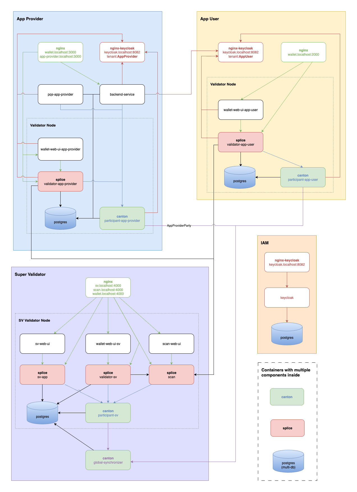
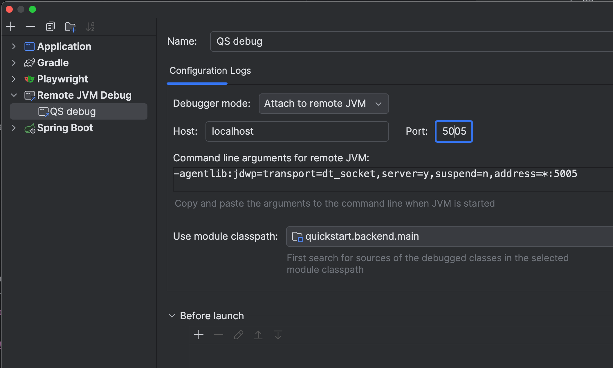

# Canton Network application quickstart

**Note**: On July 2, 2025, the quickstart underwent an architectural change and no longer connects to DevNet.
This update may require a `make clean-all` to remove old data and then a `make build`.

This project provides scaffolding to develop a Canton Network (CN) application for the Global Synchronizer.
We intend that you clone the repository and incrementally update the solution to match your business operations.
We assume that you have a Daml Enterprise license to leverage all of this project's features at runtime.
However, an OSS developer can benefit from this project by understanding how a CN Global Synchronizer application is structured.

[Binaries terms and conditions](https://github.com/digital-asset/cn-quickstart/blob/main/terms.md).

Licensed under the BSD Zero Clause License.

## Disclaimer

Once you are familiar with the Quickstart Application, review the technology choices and the application design to determine what changes are needed.
These decisions are up to you. 
The CN Quickstart is a rapidly evolving work in progress.

## Docs and guides

You can find Quickstart documentation in the Canton Network documentation portal.
- [Quickstart Installation](https://docs.digitalasset.com/build/3.3/quickstart/download/cnqs-installation.html)
- [Exploring The Demo](https://docs.digitalasset.com/build/3.3/quickstart/operate/explore-the-demo.html)
- [Project Structure](https://docs.digitalasset.com/build/3.3/quickstart/configure/project-structure-overview.html)
- [FAQ](https://docs.digitalasset.com/build/3.3/quickstart/troubleshoot/cnqs-faq.html)
- [Observability and Troubleshooting Overview](https://docs.digitalasset.com/build/3.3/quickstart/observe/observability-troubleshooting-overview.html)

### Technical documentation

- [Observability](sdk/docs/user/001-observability.md)
- [Topology](sdk/docs/user/002-topology.md)

This project is rapidly enhanced, so please check back often for updates.

## Setup

See the [Quickstart Installation Guide](https://docs.digitalasset.com/build/3.3/quickstart/download/cnqs-installation.html) for installation and setup directions.

## Quickstart

To start the application:

```bash
# In the local repository directory
$ direnv allow
$ cd quickstart

# Setup your quickstart environment
$ make setup

# Build the application
$ make build

# Start the application, Canton services, and Observability (if enabled)
$ make start

# In a separate shell - run a Canton Console for the App Provider
$ make canton-console

# In a separate shell - run Daml Shell
$ make shell
```

An assistant helps set up deployment when running `make start` for the first time. 
You can choose to run the application in standard mode or test mode and with or without OAUTH2. 
You may change this later by running `make setup`.

## Debugging TL;DR

If a container fails to start, there are a few things to try:

- Ensure Docker Compose is configured to allocate enough memory. The recommended minimum total memory is 8 GB.
- Start fresh with `make clean-all` and then manually delete all Docker images and volumes.
- You may need to upgrade to a more recent version of the Daml SDK. Run `make install-daml-sdk` to assess your version and upgrade if you're not on the latest version.

**Note**: The CN Quickstart uses Java SDK version `Eclipse Temurin JDK version 21` which runs within the Docker container.  This information is specified in `quickstart/compose.yaml` and `.env`.

If you need assistance, please follow these directions to gather the log information needed for debugging:
1. `make install-daml-sdk`  # make sure you have the latest sdk
2. `make setup`             # optional
3. `make clean-all`         # remove data from prior runs
4. `make capture-logs`      # this needs to be done in a separate terminal because it will block and keep running.  Use `<ctrl-c>` to stop
5. `make start`             # start the system with logging enabled
6. `tar -czvf <your file name with .tar.gz>` logs  # gather the content of the `logs` directory into a file


## Available make targets

Run `make help` to see a list of all available targets.
Read the [FAQ Make target reference](9https://docs.digitalasset.com/build/3.3/quickstart/troubleshoot/cnqs-faq.html#cn-app-quickstart-make-target-reference) for a detailed list of make targets and their descriptions.

## Topology

Quickstart is built on top of https://github.com/hyperledger-labs/splice/tree/main/cluster/compose/localnet. Check [documentation](https://docs.sync.global/app_dev/testing/localnet.html) for more information about Splice LocalNet.

This diagram summarizes the relationship of services that are started as part of `make start`. The `canton` and `splice` services are configured to serve multiple logically separate components (each component represented with a box in the diagram) from a single container to reduce resource consumption. Similarly the `postgres` service contains multiple databases required by Quickstart services. One `nginx` service is used as proxy for all Quickstart services that needs one except for `keycloak` that has its own `nginx-keycloak` as it needs to be ready before other services start. The focus of `Canton Network Quickstart` is to provide a development environment for App Providers.



For more information and detailed diagrams, please refer to the [Topology](sdk/docs/user/002-topology.md) documentation.

## Accessing frontends

After starting the application with `make start` you can access the following UIs:

### Application UIs

- **App User ANS UI**
    - **URL**: [http://ans.localhost:2000](http://ans.localhost:2000)
    - **Description**: Interface for registering names.

- **App Provider ANS UI**
    - **URL**: [http://ans.localhost:3000](http://ans.localhost:3000)
    - **Description**: Interface for registering names.

- **Application user frontend**
  - **URL**: [http://app-provider.localhost:3000](http://app-provider.localhost:3000)
  - **Description**: The main web interface of the application.

- **App user wallet UI**
  - **URL**: [http://wallet.localhost:2000](http://wallet.localhost:2000)
  - **Description**: Interface for managing user wallets.

- **App provider wallet UI**
  - **URL**: [http://wallet.localhost:3000](http://wallet.localhost:3000)
  - **Description**: Interface for managing user wallets.

### Super Validator UIs (if LocalNet enabled via `make setup`)

- **Super Validator web UI**
  - **URL**: [http://sv.localhost:4000](http://sv.localhost:4000)
  - **Description**: Interface for super validator functionalities.

- **Scan Web UI**
  - **URL**: [http://scan.localhost:4000](http://scan.localhost:4000)
  - **Description**: Interface to monitor transactions.

  > **Note**: `LocalNet` rounds may take up to 6 rounds (equivalent to one hour) to display in the scan UI.

The `*.localhost` domains will resolve to your local host IP `127.0.0.1`.

## External Token Transfers

For external integrations requiring token transfers, the system uses Registry API endpoints rather than direct contract queries. 
Unlike direct contract access, external token transfers are handled through Registry API endpoints exposed by the Scan app.

**LocalNet Endpoint:**
Transfer Factory: `http://scan.localhost:4000/registry/transfer-instruction/v1/transfer-factory`

## Exploring Quickstart Docker Compose

Before exploring advanced topics, we recommend familiarizing yourself with the core components of the Licensing Model Workflow within Quickstart. 
In particular, the implementation of the `backend-service` serves as an excellent entry point.

If you have already explored the Quickstart web UI and would now like to understand how the Quickstart Docker Compose configuration is orchestrated, start by running a simple setup using `make setup` with Observability and OAuth2 disabled. Then, execute the following command to inspect the resolved configuration for the backend service:

```bash
make compose-config | tail -n +2 | yq eval '.services.backend-service'
```

This command outputs a configuration similar to the example below:

```yaml
command:
  - /app/start.sh
container_name: backend-service
depends_on:
  pqs-app-provider:
    condition: service_started
    required: true
  splice-onboarding:
    condition: service_healthy
    required: true
environment:
  _JAVA_OPTIONS: -XX:-UseCompressedOops -Xms512m -Xmx700m
  AUTH_APP_PROVIDER_BACKEND_USER_NAME: app-provider-backend
  BACKEND_PORT: "8080"
  LEDGER_HOST: canton
  LEDGER_PORT: "3901"
  POSTGRES_DATABASE: pqs-app-provider
  POSTGRES_HOST: postgres
  POSTGRES_PASSWORD: supersafe
  POSTGRES_PORT: "5432"
  POSTGRES_USERNAME: cnadmin
  SPRING_PROFILES_ACTIVE: shared-secret
  VALIDATOR_URI: http://splice:3903/api/validator
image: eclipse-temurin:17.0.12_7-jdk
labels:
  description: 'Backend service supporting the Quickstart Licensing workflow. Note: The APP_PROVIDER_PARTY environment variable is dynamically resolved at runtime before the main process is initiated.'
mem_limit: "1073741824"
networks:
  default: null
ports:
  - mode: ingress
    target: 8080
    published: "8080"
    protocol: tcp
volumes:
  - type: bind
    source: /repositories/cn-quickstart/quickstart/backend/build/distributions/backend.tar
    target: /backend.tar
    bind:
      create_host_path: true
  - type: bind
    source: /repositories/cn-quickstart/quickstart/docker/backend-service/start.sh
    target: /app/start.sh
    bind:
      create_host_path: true
  - type: volume
    source: onboarding
    target: /onboarding
    volume: {}
working_dir: /app
```

This configuration demonstrates how the `backend-service` relies on the Quickstart-provided infrastructure. Quickstart automates much of the local environment setup for LocalNet, allowing you to prioritize application development. As you progress toward deployment and explore cloud orchestration, a deeper grasp of service configuration is invaluable. For now, consider these services a ready-to-use infrastructure foundation.

Then explore `register-app-user-tenant`, the service that registers AppUser tenants to the `backend-service`. This allows end users from the AppUser organization to log in and quickly start the web UI. That, in turn, ties the AppUser Identity Provider to the AppUser primary party ID. If the end user is logged in through this Identity Provider, the user can then act as the AppUser primary party. The `register-app-user-tenant` service utilizes functionality provided by the `splice-onboarding` module to make the task as simple as possible.

This step can also be performed manually through the web UI if you log in to Quickstart as `app-provider` and navigate to the tenants tab. At that tab, you can also see a list of registered tenants and verify that the `AppUser` tenant was automatically pre-registered for you by `register-app-user-tenant`.

Once you run `make create-app-install-request`, the `docker/create-app-install-request` service executes a script that initiates the Licensing workflow on behalf of the `app-user`. This script leverages the capabilities of the `splice-onboarding` module to streamline the process. In a production environment, the initial Licensing workflow step would be executed by submitting a command to the AppUser Participant Node, potentially supported by a dedicated web UI within the AppUser infrastructure.


### Authorization

Quickstart support to different authorization modes:
- **oauth2** (default)
- **shared-secret**
See Splice LocalNet documentation for the shared-secret mode which is default Splice LocalNet auth mode.

#### OAuth2 mode - keycloak setup
To perform operations such as creating AppInstallRequest and renewing License, users must be authenticated and authorized. 
The endpoints that perform these operations are protected by OAuth2 Authorization Code Grant Flow. 
GRPC communication between the backend service and participant is secured by OAuth2 Client Credentials Flow.

In OAuth2 mode, Quickstart starts a local multi-tenant instance of [keycloak](https://www.keycloak.org/).
 Two registered tenants are `AppProvider` and `AppUser`. Tenants have pre-configured users `app-provider` and `app-user`, as well as clients needed for validator, wallet, pqs, frontend, and backend service. Pre-configured users, clients, and realms are imported from the `docker/compose/modules/keycloak/conf/data` folder on Keycloak startup. The configuration in that folder is exported from the Keycloak instance after manual configuration via [Keycloak Administration Console](http://keycloak.localhost:8082/admin/master/console/) by running commands
```
/opt/keycloak/bin/kc.sh export --dir=/opt/keycloak/data/import --realm AppUser --optimized
/opt/keycloak/bin/kc.sh export --dir=/opt/keycloak/data/import --realm AppProvider --optimized
```
Pre-configured users, clients and realms are used directly in Quickstart components and via environment variables. Each component, module or backend-service refers to the pre-configured values in its environment variables. e.g. `docker/modules/keycloak/env/app-provider/on/oauth2.env`, `docker/backend-service/onboarding/env/oauth2.env`

#### Backend service tenant registration
Only the end users from an organization registered using endpoint `http://backend-service:${BACKEND_PORT}/admin/tenant-registrations` can log into the Quickstart web UI. 
The `AppUser` organization is registered on the Quickstart startup by calling the registration script in the `register-app-user-tenant` Docker container.

# Port mappings

## Web UIs

| Service | Port | URL Pattern | Description |
|---------|------|-------------|-------------|
| App User UI | 2000 | `*.localhost:2000` | App User wallet & ANS interfaces |
| App Provider UI | 3000 | `*.localhost:3000` | App Provider & application frontend |
| SV UI | 4000 | `*.localhost:4000` | Super Validator, Scan & SV web UIs |
| Swagger UI: External | 9090 | `localhost:9090` | API documentation browser (host access) |
| Swagger UI: Internal | 8080 | - | API documentation browser (container) |

## Application services

| Service | Port | Description |
|---------|------|-------------|
| Backend Service | 8080 | Spring Boot backend for Licensing workflow |
| Backend Debug (JVM) | 5005 | Remote JVM debugging (when `DEBUG_ENABLED=true`) |

## Canton Participant Ledger API

| Role | Port | Description |
|------|------|-------------|
| SV Participant | 4901 | Super Validator Ledger API |
| App Provider Participant | 3901 | App Provider Ledger API |
| App User Participant | 2901 | App User Ledger API |

## Canton Participant admin API

| Role | Port | Description |
|------|------|-------------|
| SV Participant | 4902 | Super Validator Admin API |
| App Provider Participant | 3902 | App Provider Admin API |
| App User Participant | 2902 | App User Admin API |

## Canton JSON API (HTTP Ledger API)

| Role | Port | Description |
|------|------|-------------|
| SV Participant | 4975 | Super Validator JSON API |
| App Provider Participant | 3975 | App Provider JSON API |
| App User Participant | 2975 | App User JSON API |

## Splice Validator admin API

| Role | Port | Description |
|------|------|-------------|
| SV Validator | 4903 | Super Validator Admin API |
| App Provider Validator | 3903 | App Provider Validator Admin API |
| App User Validator | 2903 | App User Validator Admin API |

## Database

| Service | Port | Description |
|---------|------|-------------|
| PostgreSQL | 5432 | Multi-database PostgreSQL instance |

## Authentication (When OAuth2 enabled)

| Service | External port | Internal port | Description |
|---------|--------------|---------------|-------------|
| Keycloak (via nginx) | 8082 | 8082 | Identity Provider for OAuth2 |
| Keycloak Health | - | 9000 | Internal health check endpoint |

## Observability stack

| Service | External port | Internal port | Description |
|---------|--------------|---------------|-------------|
| Grafana | 3030 | 3000 | Metrics & logs dashboard |
| OTEL Collector (OTLP) | - | 14001 | OpenTelemetry OTLP receiver |
| OTEL Collector (Fluentd) | 14002 | 14002 | Log collection endpoint |
| Prometheus | - | 14011 | Metrics storage & query |
| Loki | - | 14012 | Log aggregation |
| Tempo (OTLP) | - | 14013 | Trace collection |
| Tempo (HTTP) | - | 14014 | Trace query API |
| Canton Metrics | - | 14021 | Canton metrics endpoint |
| cAdvisor | - | 14022 | Container metrics |
| Postgres Exporter | - | 14023 | PostgreSQL metrics |
| Nginx Exporter | - | 14024 | Nginx metrics |

## Port suffix scheme

Quickstart uses a port suffix scheme for participant/validator services:

| Suffix | Service type |
|--------|-------------|
| 901 | Ledger API |
| 902 | Admin API |
| 903 | Validator Admin API |
| 961 | gRPC Health Check |
| 975 | JSON API |
| 900 | HTTP Health Check |

**Prefix convention:**
- `4xxx` = Super Validator (SV)
- `3xxx` = App Provider
- `2xxx` = App User

## Localhost domain mappings

| URL | Port | Service |
|-----|------|---------|
| http://wallet.localhost:2000 | 2000 | App User Wallet UI |
| http://ans.localhost:2000 | 2000 | App User ANS UI |
| http://wallet.localhost:3000 | 3000 | App Provider Wallet UI |
| http://ans.localhost:3000 | 3000 | App Provider ANS UI |
| http://app-provider.localhost:3000 | 3000 | Application Frontend |
| http://sv.localhost:4000 | 4000 | SV Web UI |
| http://scan.localhost:4000 | 4000 | Scan Web UI |
| http://keycloak.localhost:8082 | 8082 | Keycloak Admin Console |
| http://app-provider.localhost:5173 | 5173 | Vite Dev Server (development) |

# Docker Compose-based development for LocalNet
Quickstart leverages Docker Compose for modular development. 
Instead of relying on a single extensive docker-compose.yaml file, this approach orchestrates multiple compose files and corresponding environment files for each Quickstart module. 
Splice LocalNet is housed within the `docker/modules/localnet` directory. 
In the `Makefile`, Docker Compose commands are dynamically assembled from Splice LocalNet, Quickstart modules, and Quickstart-specific compose and environment files, arranged in an order that respects the interdependencies of the various components.

Some modules (e.g., Keycloak and Observability) are optional and can be toggled on or off based on your selections made during `make setup`. 
When the Docker Compose command is executed, it merges all specified Compose YAML files in the order they appear on the command line. 
Likewise, the environment is built by applying each environment file in sequence; if the same variable is defined in multiple files, the value from the later file will overwrite the previous ones.

The `splice-onboarding` module supports two distinct operational modes. 
Initially, it performs a one-time setup procedure for Canton, Splice and modules. 
This initialization includes creating a ledger user and assigning necessary permissions. 
Developers can customize this process by specifying DAR files (and mounting it to file in `/canton/dars` in `splice-onboarding`) for ledger upload, custom shell scripts, or environment variables through their project’s `compose.yaml` file. 
For example:

```yaml
splice-onboarding:
  env_file:
    - ./docker/backend-service/onboarding/env/${AUTH_MODE}.env
  volumes:
    - ./docker/backend-service/onboarding/onboarding.sh:/app/scripts/on/backend-service.sh
    - ./daml/licensing/.daml/dist/quickstart-licensing-0.0.1.dar:/canton/dars/quickstart-licensing-0.0.1.dar
```

Developers may want to leverage the `splice-onboarding` module to execute custom onboarding scripts once all dependent services are operational (for instance, the `register-app-user-tenant` script) or to initialize specific workflows (such as scripts defined in `/docker/create-app-install-request/compose.yaml`).

By integrating this approach, developers can leverage prepopulated environment variables, such as `APP_PROVIDER_PARTY` and other authentication-related settings, while also accessing a suite of tools bundled with the `splice-onboarding` container. 
These tools, including utilities like curl, jq, and jwt-cli, together with an library of shell functions found in `docker/modules/splice-onboarding/docker/utils.sh` that demonstrate on how to utilize JSON Ledger API HTTP endpoints effectively. 
This comprehensive setup facilitates the achievement of necessary functionality with minimal additional configuration.

Utilizing Docker Compose’s [merge mechanism](https://docs.docker.com/compose/how-tos/multiple-compose-files/merge/), developers have complete control over the configuration. 
They can add any settings by providing a custom `compose.yaml` (which is usually the first file processed in the Docker Compose command) or by appending a `compose.override.yaml` file at the end to override default configurations defined by Splice LocalNet or Quickstart modules.

Please note that while Quickstart is designed to streamline local development, deploying to production requires additional considerations. 
In the Quickstart demo, the `splice-onboarding` component facilitates initialization, onboarding, and the execution of scripts that drive the demonstration workflows. 
However, this component is not intended for use in a production environment. 
In a production-grade environment, you would typically utilize an orchestration framework such as Kubernetes and replace certain automated configurations with controlled, manual configuration steps. 
This approach enhances security and clearly separates services in line with enterprise standards.

### Modules

The Quickstart repository includes modular components that can be reused in developer projects outside of Quickstart. 
These modules are located in the `docker/modules` directory by default, however, they can be sourced from any directory by setting the `MODULES_DIR` environment variable accordingly.

Splice LocalNet is a special module borrowed from the [Splice repository](https://github.com/hyperledger-labs/splice/tree/main/cluster/compose/localnet) and is placed by default in `docker/modules`. It can also be relocated by properly configuring the LOCALNET_DIR environment variable.

Each module provides specific functionality and may depend on other modules. The currently supported modules are:

- **keycloak** (optional): Adds support for OAuth2 authorization to Splice LocalNet.
- **splice-onboarding**: Provides onboarding capabilities, including a collection of tools, resolved environment settings, and shell scripts for calling JSON Ledger API HTTP endpoints.
- **pqs**: Offers preconfigured PQS instances for Splice LocalNet participants.
- **observability**: Introduces observability infrastructure components.
- **daml-shell**: A standalone module that enables launching Daml Shell. By default, it connects to the pqs-app-provider’s Postgres database.

### Docker Profiles
Docker profiles are used in both Splice LocalNet and Quickstart to enable or disable specific functionalities. Each module can support multiple profiles. 
For example, Splice LocalNet defines the following five profiles:
- **app-provider**
- **app-user**
- **sv**
- **swagger-ui**
- **console**

The `console` module runs as a standalone container, while the other modules start by default unless explicitly disabled (e.g., by omitting the profile flag such as --profile app-provider). 
In some implementations, modules rely on environment variables to determine the active profiles. 
In these cases, you should set the corresponding environment variable—such as APP_PROVIDER_PROFILE—to either "on" or "off". This approach is necessary because Docker does not inherently expose profile configuration details within the Docker Compose file or inside the container environments.

### Environment

There are two distinct types of environment files:

- Files used primarily for Docker Compose configuration.
- Files intended for Docker container environment settings.

The first category includes files such as `.env`, `.env.local`, `${LOCALNET_DIR}/env/common.env`, and any `compose.env` files from the modules. The second category encompasses the remaining files found under `${LOCALNET_DIR}/env` as well as the `env` directories within the modules.

In the Docker container environment files, you can reference variables defined in the Docker Compose environment. Simply declare a variable as `VAR=${VAR}` to ensure that the value from the Docker Compose environment is available within the container.


### Dynamic Configuration

In certain situations, it is necessary to share runtime information between services. For instance, in the case of the `backend-service`, the environment variable `APP_PROVIDER_PARTY` is mandatory. In a production-like environment, this information would typically be provided manually by a system administrator. The party ID becomes available only after the complete initialization of Canton/Splice. To automate this process, one might consider retrieving the party ID by querying the JSON Ledger API HTTP endpoint; however, adding extra environment variables to support JWT token retrieval for this purpose could clutter the backend service configuration.

A preferable solution is to leverage the existing `splice-onboarding` service, which already possesses the appropriate environment and tools to perform this task. By mounting a custom script into the splice-onboarding container (for example, mapping `./docker/backend-service/onboarding/onboarding.sh` to `/app/scripts/on/backend-service.sh`), the splice-onboarding service executes the script (or any script located in the `/app/scripts/on/` directory) at the conclusion of its initialization routine.

Within the script, the acquired information can be shared with the backend service as follows:
```
  share_file "backend-service/on/backend-service.sh" <<EOF
  export APP_PROVIDER_PARTY=${APP_PROVIDER_PARTY}
EOF
```
In this context, `share_file` is a utility function that writes the provided content (the second argument) to the specified file (the first argument) on the shared volume `onboarding`. This volume is also mounted in the `backend-service`, and the startup script (docker/backend-service/start.sh) sources the newly shared script prior to executing the main command of the backend service, thereby ensuring that the `APP_PROVIDER_PARTY` environment variable is available to the service.

## Local Development

### Frontend

#### Restart frontend
Run:
```bash
make restart-frontend
```
This target restarts the frontend and handles any required rebuilds.

#### Vite development
Use Vite's hot-module reloading for fast UI iteration:

```bash
make start-vite-dev
```
or, if Quickstart is already running:
```bash
make vite-dev
```
Open the app at: http://app-provider.localhost:5173

Note: Use the same host/port so OAuth redirects (Keycloak) continue to work.

#### Debugging in VS Code
Create or update quickstart/frontend/.vscode/launch.json with:

```json
{
  "version": "0.2.0",
  "configurations": [
    {
      "name": "Vite: Chrome Debug",
      "type": "chrome",
      "request": "launch",
      "url": "http://app-provider.localhost:5173",
      "webRoot": "${workspaceFolder}/quickstart/frontend/src"
    }
  ]
}
```

This launches Chrome against the Vite server and maps breakpoints to your source files. If you change user sessions (login/logout) or Keycloak redirects occur, reload the page so VS Code can resolve sources.

### Backend service

#### Restart backend
Run:
```bash
make restart-backend
```
This target restarts the backend, handles dependent services (e.g., register-app-user-tenant), and rebuilds the service if needed.

#### Debug backend service
Enable remote JVM debugging by setting:
```bash
export DEBUG_ENABLED=true
make restart-backend
```
This opens port 5005. Use the following JVM agent options for your remote debugger:
```
-agentlib:jdwp=transport=dt_socket,server=y,suspend=n,address=*:5005
```
Configure your IDE (IntelliJ, VS Code) to attach to port 5005 for step-through debugging.

Example in IntelliJ Idea


### Viewing logs
For interactive local log inspection we recommend lnav (https://lnav.org/). Install the Canton log format and use it to view ``*.clog`` files. Example Canton lnav format definition:
https://github.com/hyperledger-labs/splice/blob/main/canton/canton-json.lnav.json

Open the logs directory with lnav to filter and analyze logs efficiently.


## License

**You may use the contents of this repository in parts or in whole according to the `0BSD` license.**

Copyright &copy; 2026 Digital Asset (Switzerland) GmbH and/or its affiliates

> Permission to use, copy, modify, and/or distribute this software for
> any purpose with or without fee is hereby granted.
>
> THE SOFTWARE IS PROVIDED “AS IS” AND THE AUTHOR DISCLAIMS ALL
> WARRANTIES WITH REGARD TO THIS SOFTWARE INCLUDING ALL IMPLIED WARRANTIES
> OF MERCHANTABILITY AND FITNESS. IN NO EVENT SHALL THE AUTHOR BE LIABLE
> FOR ANY SPECIAL, DIRECT, INDIRECT, OR CONSEQUENTIAL DAMAGES OR ANY
> DAMAGES WHATSOEVER RESULTING FROM LOSS OF USE, DATA OR PROFITS, WHETHER IN
> AN ACTION OF CONTRACT, NEGLIGENCE OR OTHER TORTIOUS ACTION, ARISING OUT
> OF OR IN CONNECTION WITH THE USE OR PERFORMANCE OF THIS SOFTWARE.
