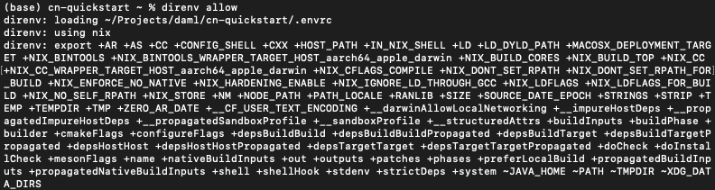
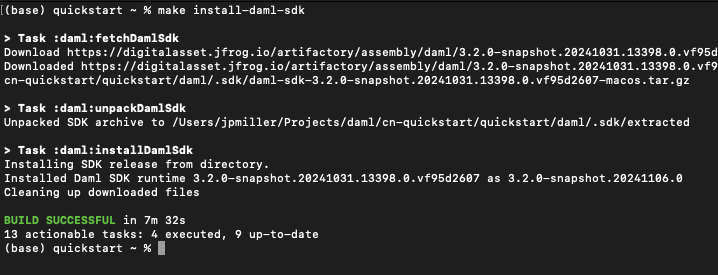
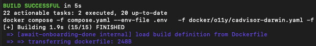
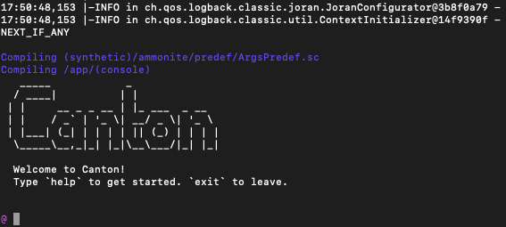
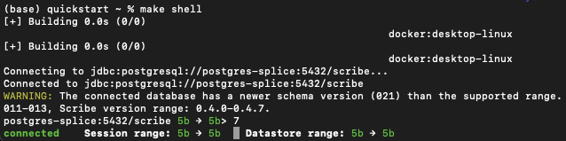

.. _quickstart-cnqs-installation:

======================================
Canton Network quickstart installation
======================================

.. contents:: Contents
   :depth: 2
   :local:
   :backlinks: top

Introduction
============

The Quickstart application helps you and your team become familiar with CN application development by providing **essential** scaffolding.
The Quickstart application provides a launchpad and is intended to be extended to meet your business needs.
When you are familiar with the Quickstart, review the technology choices and application design to determine what changes are needed.
Technology and design decisions are ultimately up to you.

Overview
========

This guide walks through the installation and ``LocalNet`` deployment of the CN Quickstart.
We have provided a `fast path installation <#fast-path-installation>`__ 
and `step-by-step instructions <#step-by-step-instructions>`__, based on level of experience, for your convenience.
Please contact your representative at Digital Asset if you find errors.

Roadmap
-------

 * After installation, :ref:`quickstart-explore-the-demo` to complete a business operation in the example application.
 * For an overview of how the Quickstart project is structured, read :ref:`quickstart-project-structure-guide`.
 * Learn about debugging features in the :ref:`quickstart-observability-troubleshooting-overview`.

Prerequisites
=============

Access to the `CN-Quickstart GitHub repository <https://github.com/digital-asset/cn-quickstart>`__ is needed to successfully pull the Digital Asset artifacts.

`Contact us <https://www.digitalasset.com/contact-us?comments=I%27m%20requesting%20access%20to%20jFrog>`__ if you need access or additional support.

The CN Quickstart is a Dockerized application and requires `Docker Desktop <https://www.docker.com/products/docker-desktop/>`__.
We recommend allocating 8 GB of memory to Docker Desktop.
Allocate additional resources if you witness unhealthy containers, if possible.
Decline Observability if your machine does not have sufficient memory.

Other requirements include:
  -  `Curl <https://curl.se/download.html>`__

  -  `Direnv <https://direnv.net/docs/installation.html>`__

  -  `Nix <https://nixos.org/download/>`__

  -  Windows users must install and use
     `WSL 2 <https://learn.microsoft.com/en-us/windows/wsl/install>`__ with
     administrator privileges.

Nix download support
--------------------

   Check for Nix on your machine.

   ``nix --version``

   If the command returns something like:

   ``Nix (Nix) 2.25.2``

   Congratulations, you’re done.

   Recommended installation for MacOS.

   ``sh <(curl -L https://nixos.org/nix/install)``

   | Recommended installation for Linux.
   | (Windows users should run this and all following commands in WSL 2).

   ``sh <(curl -L https://nixos.org/nix/install) --daemon``

Fast path installation
======================

If you are familiar with the prerequisites, use these abbreviated installation instructions.
More detailed instructions are provided below.

1. `Clone from GitHub <#clone-from-github>`__ and cd into the ``cn-quickstart`` repository: ``git clone https://github.com/digital-asset/cn-quickstart.git``
2. Verify that the `Docker Desktop <#docker>`__ app is running on your computer: ``docker info``
3. Login to Docker repositories via the terminal: ``docker login``
4. **cd** into the ``quickstart`` subdirectory: ``cd quickstart``
5. `Install the Daml SDK <#install-daml-sdk>`__ from the quickstart subdirectory: ``make install-daml-sdk``
6. `Configure the local development <#deploy-a-validator-on-localnet>`__ environment: ``make setup``
7. When prompted, enable OAuth2, disable Observability, disable TEST MODE, and leave the party hint blank to use the default value.
8. Build the application from the ``quickstart`` subdirectory: ``make build``
9. In a new terminal window, initiate log collection from the ``quickstart`` subdirectory: ``make capture-logs``
10. Return to the previous terminal window to start the application and Canton services: ``make start``
11. Optional - In a separate shell, from the ``quickstart`` subdirectory, run the `Canton Console <#connecting-to-the-local-canton-nodes>`__: ``make canton-console``
12. Optional - In a fourth shell, from the ``quickstart`` subdirectory, begin the Daml Shell: ``make shell``
13. When complete, `close the application <#closing-the-application>`__ and other services with: ``make stop && make clean-all``
14. If applicable, close Canton Console with ``exit`` and close Daml Shell with ``quit``.

Step-by-step instructions
=========================

Clone from GitHub
-----------------

Clone and **cd** into the ``cn-quickstart`` repository into your local machine.

::

   git clone https://github.com/digital-asset/cn-quickstart.git
   cd cn-quickstart
   direnv allow

Docker
------

Verify that the Docker Desktop application is running on your computer.

Login to Docker repositories via the terminal.

::

   docker login

The last command requires a `Docker Hub <https://app.docker.com/>`__ username and password or *Personal Access Token (PAT)*.

Commands should return ‘Login Succeeded’.

Install Daml SDK
----------------

**cd** into the ``quickstart`` subdirectory and install the Daml SDK from the quickstart subdirectory.

::

   cd quickstart
   make install-daml-sdk

.. note:: The ``Makefile`` providing project choreography is in the ``quickstart/``
          directory. ``make`` only operates within ``quickstart/``.
   
          If you see errors related to ``make``, double check your present working directory.

The Daml SDK is large and can take several minutes to complete.

Deploy a validator on LocalNet
------------------------------

Configure the local development environment by running ``make setup``.

Disable ``Observability``.
Enable OAuth2. 
Leave the party hint blank to use the default and disable ``TEST MODE``.

  The party hint is used as a party node’s alias of their identification hash.
  The Party Hint is not part of the user’s identity. 
  It is a convenience feature. 
  It is possible to have multiple party nodes with the same hint.

::

  | % make setup
  |  Starting local environment setup tool...
  |  ./gradlew configureProfiles --no-daemon --console=plain --quiet
  |  Enable Observability? (Y/n): n
  |  OBSERVABILITY_ENABLED set to 'false'.

  | Enable OAUTH2? (Y/n): y
  | AUTH_MODE set to 'oauth2'.

  | Specify a party hint (this will identify the participant in the
    network) [quickstart-USERNAME-1]:
  | PARTY_HINT set to ‘quickstart-USERNAME-1’.

  | Enable TEST_MODE? (Y/n): n
  |   TEST_MODE set to 'off'.

  | ``.env.local`` updated successfully.

You can change these choices any time by running ``make setup`` again.

   OAuth2 and Observability may be unstable if your machine has less than 8 GB of memory to allocate to Docker Desktop.

Build the application.

::

   make build

In a new terminal window, initiate log collection from the ``quickstart`` subdirectory.

::

   make capture-logs

Once complete, return to the previous terminal to start the application and Canton services.

::

   make start

Connecting to the Local Canton Nodes
------------------------------------

In a separate shell, from the ``quickstart`` subdirectory, run the Canton Console.

::

   make canton-console

In a fourth shell, from the quickstart subdirectory, begin the Daml Shell.

::

   make shell

Closing the application
-----------------------

*⚠️ (If you plan on immediately using the CN Quickstart then delay execution of this section)*

Close Canton console
~~~~~~~~~~~~~~~~~~~~

When complete, open the Canton console terminal.
Run ``exit`` to stop and remove the console container.

Close Daml shell
~~~~~~~~~~~~~~~~

In the Daml shell terminal, execute ``quit`` to stop the shell container.

Close the CN Quickstart
~~~~~~~~~~~~~~~~~~~~~~~

Finally, close the application and observability services with:

::

  make stop && make clean-all

It is wise to run make ``clean-all`` during development and at the end of each
session to avoid conflict errors on subsequent application builds.

Next steps
==========

You have successfully installed the CN Quickstart.

The next section, “Exploring The Demo,” provides a demonstration of the example application.

Connecting your application to The Canton Network
-------------------------------------------------

The ``LocalNet`` deployment connects to a local validator which is in turn connected to a local super-validator (synchronizer).
Staging and final production deployments require connecting to a validator that is in turn connected to the public Canton Network.

The Canton Network provides three synchronizer pools.
The production network is ``MainNet``; the production staging network is ``TestNet``.
As a developer you will mostly be connecting to the development staging network ``DevNet``.

Access to `a SV Node <https://docs.dev.sync.global/validator_operator/validator_onboarding.html>`__
that is whitelisted on the CN is required to connect to DevNet. The GSF publishes a `list of SV nodes <https://sync.global/sv-network/>`__
who have the ability to sponsor a Validator node.
To access ``DevNet``, contact your sponsoring SV agent for VPN connection information.

Resources
=========

  * `Curl <https://curl.se/download.html>`__
  * `Direnv <https://direnv.net/docs/installation.html>`__
  * `Docker Desktop <https://www.docker.com/products/docker-desktop/>`__
  * `Docker Hub <https://app.docker.com/>`__
  * `GSF list of SV Nodes <https://sync.global/sv-network/>`__
  * `Digital Asset Docker <https://console.cloud.google.com/artifacts/docker/da-images/europe/public>`__
  * `Nix <https://nixos.org/download/>`__
  * `Quickstart GitHub repository <https://github.com/digital-asset/cn-quickstart>`__
  * `Validator onboarding documentation <https://docs.dev.sync.global/validator_operator/validator_onboarding.html>`__
  * `WSL 2 <https://learn.microsoft.com/en-us/windows/wsl/install>`__
