.. _quickstart-observability-troubleshooting-overview:

==================================================================
Canton Network Quickstart observability & troubleshooting overview
==================================================================

.. wip::

.. Note:: The screenshots in this guide are taken from
   multiple sessions and are inconsistent
   with each other.
   This will be rectified once some of the updates are committed.

**Contents**

`Overview of observability <#overview-of-observability>`__

   `The LocalNet configuration <#the-localnet-configuration>`__

   `Observability overview <#observability-overview>`__

   `Daml Shell <#daml-shell>`__

   `Grafana <#grafana>`__

   `Direct Postgres access <#direct-postgres-access>`__

   `Interactive debugger <#interactive-debugger>`__

`Observability and tracing <#observability-and-tracing>`__

   `Correlation identifiers <#correlation-identifiers>`__

   `Direct Ledger inspection using correlation
   identifiers <#direct-ledger-inspection-using-correlation-identifiers>`__

   `Correlated Logs and traces using correlation
   identifiers <#correlated-logs-and-traces-using-correlation-identifiers>`__

It's assumed that you have read the quickstart getting started guide and explore the demo.
If you haven't, we strongly encourage those documents to establish a baseline understanding of observability.

Overview of observability
=========================

The Canton Network quickstart deployment configuration includes a full observability suite. 
Tools preconfigured for monitoring and troubleshooting distributed Canton applications—both in development and production. 
The observability suite provides three key types of monitoring data:

-  **consolidated structured logs** for application and system events
-  **distributed traces** that visualize end-to-end transaction flows;
   and
-  **metrics** for monitoring key performance indicators.

The suite allows data types to be correlated with each other to provide insights for root cause analysis. 
In addition, the Canton Ledger also provides a variety of correlation and tracing ids that permit tracking
transaction provenance across multiple organizations and environments.

The LocalNet configuration
--------------------------

The Quickstart runtime configuration is defined in ``.env.local``, 
which allows the option to bring up a local deployment of the Observability Stack. 
This file can be created using ``$ make setup``,
which wraps the command ``$ ./gradlew configureProfiles --no-daemon --console=plain --quiet``,
or can be edited manually to set environment variables ``LOCALNET_ENABLED`` and ``OBSERVABILITY_ENABLED`` to ``true`` or ``false`` as desired.

The ``LocalNet`` runtime configuration is handled by ``docker-compose``
configured in ``compose.yaml`` using environment variables from ``.env`` in the
``quickstart/`` project root directory. 
The usual Docker commands and tooling applies.

Immediately useful commands you probably already know:

-  ``$ docker ps`` lists the running containers.

-  ``$ docker logs [-f] <container>`` fetches the logs of a container, and
   follow the logs with the ``-f`` option.

   -  If the system is not working well to the extent you do not trust
      the observability stack (discussed later), ``docker logs backend-service``
      is a good place to start looking for errors that
      might provide an insight into what has gone wrong.

-  ``$ docker restart <container>`` for those instances where a container
   seems to have become stuck.

Observability overview
----------------------

The Quickstart application provides a foundational production Daml application. 
It includes a full observability configuration which is helpful to troubleshoot or debug an application.
As a working demo, Quickstart is opinionated regarding its technology stack. 
However, the platform itself is agnostic. 
Individual components can be replaced as required.

The current troubleshooting and debugging services include:

-  Local ledger inspection via Daml shell
   (https://docs.daml.com/tools/daml-shell/index.html)

-  Datasource collection and management via **OpenTelemetry**

   -  This uses the **OTEL Collector**
      (https://opentelemetry.io/docs/collector)

-  Metrics are aggregated using **Prometheus** (https://prometheus.io/)

-  Logs are consolidated using **Loki** (https://grafana.com/oss/loki/)

-  Traces are aggregated using **Tempo**
   (https://grafana.com/oss/tempo/)

-  Aggregated observations (metrics, logs, and traces) are viewable via
   **Grafana** (https://grafana.com/oss/grafana/) which acts to allow
   hyperlinked exploration of the Observability fields.

Daml Shell
~~~~~~~~~~

Daml Shell is a terminal application that provides interactive local ledger inspection on top of PQS. 
Quickstart is configured to launch Daml Shell in a Docker container and is configured to connect to the included
application provider’s PQS instance. 
This is easiest to access via the top-level project scripts accessed via ``make`` from ``quickstart/``. 
To see this in action, build and start the quickstart app then:

Run ``$ make create-app-install-request`` to use ``curl`` to submit the
``create AppInstallRequest ...`` command to the ledger [1]_ to initiate user
onboarding [2]_. Then you can use the following Daml Shell commands:

> ``active`` to see a summary of the contracts you created; and,

> ``active quickstart-licensing:Licensing.AppInstall:AppInstallRequest`` to
see the contract details for any Asset contracts on the ledger; finally,

> ``contract [contract-id from the previous command]`` [3]_ to see the full
detail of the ``AppInstallRequest`` contract on the ledger.

> ``help [command]`` provides context help for daml shell commands. [4]_

Grafana
~~~~~~~

Grafana is accessible via its web interface, which is port-mapped to http://localhost:3030/, 
and can be opened in the current browser from the command line using ``make open-observe``.

Your debugging should focus on using Grafana's trace and log facilities, as well as ledger inspection via Daml Shell.
If you make sure that your exported logs and traces are sufficient to support debugging during development, they are more likely to support diagnostics in production, as well.

There is additional access configured into the Quickstart that can assist with debugging on ``LocalNet``. 
Use the same diagnostic tools for development as you will for production. 
If you add a log line that allows you to identify and fix a bug in development, 
then keeping it around at ``trace`` or ``debug`` log levels increases your operational readiness. 
Using tools that won’t be available in production to debug in development reduces operational readiness.

Direct Postgres access
~~~~~~~~~~~~~~~~~~~~~~

All persistent state in the example application is stored in one or more postgres databases. 
You can use the postgres configuration in ``.env`` to connect directly to these instances.

.. code-block::

   $ docker exec -it <postgres container> psql -v --username <.env username> --dbname <.env dbname> --password

For example: if you connect to the ``postgres-splice-app-provider``
container (default username ``cnadmin``, dbname ``scribe``, and password
``supersafe``; then you can use the SQL interface to PQS to examine the
app-provider’s participant’s local ledger. The SQL API to PQS is
documented in the `daml documentation <https://docs.daml.com/query/pqs-user-guide.html>`__.

Interactive debugger
~~~~~~~~~~~~~~~~~~~~

If you review the ``compose.yaml`` file and examine the configuration for backend-service you will see the lines:

.. code-block::

   backend-service:
     environment:
       ...
       JAVA_TOOL_OPTIONS: "-javaagent:/otel-agent.jar
       -agentlib:jdwp=transport=dt_socket,server=y,suspend=n,address=*:5005"

    ports:

      - "${BACKEND_PORT}:8080"
      - "5055:5005"

This enables remote debugging of the Java component backend in the user application (backend-service). 
You can use this to connect an IDE Debugger to the service at runtime if required. 
We recommend Grafana as your first resort, along with the consolidated logs in Loki.
This keeps the system debuggable in production.

Observability and tracing
=========================

Faulty distributed systems can be notoriously hard to diagnose.
From the start of a project, Quickstart provides the sort of observability and diagnostics facilities that are otherwise often only developed toward the end.
Simplifying diagnostics for new Canton Network Applications from the outset of each project is one of the motivations behind the development of Quickstart.

The links in the overview include the official user and reference documentation for the various tools included in Quickstart. 
While there is no substitute for the official documentation, 
it is hoped the following tour of the capabilities configured into Quickstart can provide a starting point for your own experimentation.

Correlation identifiers
-----------------------

Inspecting Canton begins by correlating identifiers, much like inspecting any other distributed system. 
Canton can accept and/or generate a number of identifiers suitable for correlating across both time, various nodes, and the evolving state of the ledger.

A few of the key identifiers to be aware of are:

.. list-table:: Useful Correlation Identifiers
   :widths: 15 20 60
   :header-rows: 1

   * -   ``Identifier``
     -   ``Specified by``
     -   ``Scope``
   * -   ``ApplicationId``
     -   ``The Ledger Client``
     -   ``Identifies the ledger client during command submission and processing.``
   * -   ``WorkflowId``
     -   ``The Ledger Client``
     -   ``Identifies the business process. Persisted to the ledger.``
   * -   ``CommandId``
     -   ``The Ledger Client``
     -   ``Identifies the business “act” associated with a ledger command. Persisted to the ledger. Visible only to the submitting party. Common across retries.``
   * -   ``SubmissionId``
     -   ``The Ledger Client``
     -   ``Identifies an individual ledger submission to a participant node.``
   * -   ``TransactionId``
     -   ``Daml Ledger``
     -   ``Global identifier for a committed transaction to the ledger. Only visible to participant nodes that witness or are informed of the transaction.`` [5]_
   * -   ``LedgerEventId``
     -   ``Daml Ledger``
     -   ``Global identifier for a node within a committed transaction tree corresponding to a ledger event.``
   * -   ``Trace/SpanId`` [6]_
     -   ``Ledger Client (or upstream)``
     -   ``Accepted by GRPC/HTTP ledger interfaces and honoured throughout the Canton Network code. Where one is not provided may sometimes be generated internally to provide tracing support within the network.``
   * -   ``LedgerOffset``
     -   ``Participant Node``
     -   ``The height of a transaction within the local linearization of the ledger by a participant node.`` [7]_
   * -   ``ContractId``
     -   ``Daml Ledger``
     -   ``Global identifier for a contract that was created successfully on the ledger at some point. If the contract has been subsequently archived the id remains a stable and valid way to refer to it even though the associated contract can no longer be used.``
   * -   ``TemplateId``
     -   ``Daml Application``
     -   ``Combined with a PackageId this provides a global identifier for a Daml smart contract.``
   * -   ``PartyId``
     -   ``Participant Node``
     -   ``Identifier of the Party on the Canton ledger.`` [8]_

The goal of the observability configuration is to make it easier to navigate through the provenance of any state or event in the wider system. 
Any or all of these identifiers can be used to correlate a combination of logs, metrics, and state. 
Three of these in particular are intended to be set to corresponding business identifiers derived from your specific business domain: application-id, workflow-id, and command-id.

Navigation is enabled by the use of structured logs from as many components as possible [9]_. 
It is recommended that your custom components likewise emit structured logs for more accurate consumption by OpenTelemetery.

Direct Ledger inspection using correlation identifiers
------------------------------------------------------

Starting from ``$ make stop clean-all && make build start``, we proceed with initiating the example application app-user onboarding:

.. code-block::

   $ make create-app-install-request | cat -n

.. code-block::

   docker compose -f docker/app-user-shell/compose.yaml --env-file .env run --rm create-app-install-request || true
   get_token ledger-api-user AppProvider
   get_user_party AppProvider participant-app-provider
   http://participant-app-provider:7575/v2/users/AppProvider
   get_token ledger-api-user Org1
   get_user_party Org1 participant-app-user
   http://participant-app-user:7575/v2/users/Org1
   get_token administrator Org1
   http://validator-app-user:5003/api/validator/v0/scan-proxy/dso-party-id
   http://participant-app-user:7575/v2/commands/submit-and-wait
   --data-raw {
     "commands" : [
        {
           "CreateCommand" : {
             "template_id":
             "#quickstart-licensing:Licensing.AppInstall:AppInstallRequest",
             "create_arguments": {
                "dso":
                "DSO::1220015e721c8ec5c1a5868b418442f064530e367c2587a9b43bd66f58c7bfddfec4",
                "provider":
                "AppProvider::12202fe7b2bf950dca3858b880d9ee0dd58249af8821ff2330ea1b80420852e816ff",
                "user":
                "Org1::122072b20a515d939910f9412f915cff8c1a7a427ddde76c6d0b7646d0022d4d4551",
                "meta": {"values": []}
             }
           }
        }
     ],
     "workflow_id" : "create-app-install-request",
     "application_id": "ledger-api-user",
     "command_id": "create-app-install-request",
     "deduplication_period": { "Empty": {} },
     "act_as":
     ["Org1::122072b20a515d939910f9412f915cff8c1a7a427ddde76c6d0b7646d0022d4d4551"],
     "read_as":
     ["Org1::122072b20a515d939910f9412f915cff8c1a7a427ddde76c6d0b7646d0022d4d4551"],
     "submission_id": "create-app-install-request",
     "disclosed_contracts": [],
     "domain_id": "",
     "package_id_selection_preference": []
   }
   {"update_id":
   "1220e48d6d59af99a1b61eca414fe25766c342bb4e7d8d485e049a11a7f2267ed5c0",
    "completion_offset":73}

This is the output of a script submitting a create command to the
app-user’s participant node, it already contains number of the
correlation ids mentioned above:

+----+--------------+----------------------------------------------------+
| 14 | TemplateId   | #quickstar                                         |
|    |              | t-licensing:Licensing.AppInstall:AppInstallRequest |
+----+--------------+----------------------------------------------------+
| 16 | Party Ids    | DSO::1220015e721c8ec5c1a5868b…ddfec4               |
| -  |              | AppProvider::12202fe7b2bf950d…e816ff               |
| 18 |              | Org1::122072b20a515d939910f94…4d4551               |
+----+--------------+----------------------------------------------------+
| 25 | Workflow Id  | create-app-install-request                         |
|    |              |                                                    |
+----+--------------+----------------------------------------------------+
| 26 | Application  | ledger-api-user                                    |
|    | Id           |                                                    |
|    |              |                                                    |
+----+--------------+----------------------------------------------------+
| 27 | Command      | create-app-install-request                         |
|    | Id           |                                                    |
+----+--------------+----------------------------------------------------+
| 31 | Submission   | create-app-install-request                         |
|    | Id           |                                                    |
|    |              |                                                    |
+----+--------------+----------------------------------------------------+
| 36 | Transaction  | 1220e48d6d59af99a1b61eca414fe…7ed5c0               |
|    | Id           |                                                    |
|    |              |                                                    |
+----+--------------+----------------------------------------------------+

We can immediately use the transaction id in Daml Shell to view the
associated ledger transaction:

.. code-block::

   $ make shell
    docker compose -f docker/daml-shell/compose.yaml --env-file .env run --rm daml-shell || true
    Connecting to jdbc:postgresql://postgres-splice-app-provider:5432/scribe...
    Connected to jdbc:postgresql://postgres-splice-app-provider:5432/scribe
    postgres-splice-app-provider:5432/scribe> transaction 1220e48d6d59af99a1b61eca414fe25766c342bb4e7d8d485e049a11a7f2267ed5c0
    transactionId: 1220e48d6d59af99a1b61eca414fe25766c342bb4e7d8d485e049a11a7f2267ed5c0, offset: 48, workflowId: create-app-install-request - Feb 17, 2025, 5:26:09 AM
    + #1220e48d6d59af99a1b61eca414fe25766c342bb4e7d8d485e049a11a7f2267ed5c0:0
    quickstart-licensing:Licensing.AppInstall:AppInstallRequest (005c17f89b7fd1d5fde9c548740c32924edeeddacc6320256892636b4e3b7d66aaca1)
    {"dso": "DSO::1220015e721c8ec5c1a5868b418442f064530e367c2587a9b43bd66f58c7bfddfec4", "meta": {"values": []}, "user": "Org1::122072b20a515d939910f9412f915cff8c1a7a427ddde76c6d0b7646d0022d4d4551", "provider": "AppProvider::12202fe7b2bf950dca3858b880d9ee0dd58249af8821ff2330ea1b80420852e816ff"}
    postgres-splice-app-provider:5432/scribe 3f → 48>

From here we can get more identifiers:

+------------+---------------------------------------+
| Ledger     | 48                                    |
| Offset     |                                       |
+------------+---------------------------------------+
| Ledger     | #122026e55e3f82e27542...:0            |
| Event Id   |                                       |
+------------+---------------------------------------+
| Contract   | 00cb53139ff0eb7ec57b...               |
| Id         |                                       |
+------------+---------------------------------------+

The Workflow Id, Template Id, and Party Ids are also visible here. The
ledger offset can be very useful if you are going to query PQS or the
Ledger API directly for more information. The Contract Id can be used to
immediately display the contract in Daml Shell:

.. code-block::

   postgres-splice-app-provider:5432/scribe 3f → 48> contract 005c17f89b7fd1d5fde9c548740c32924edeeddacc6320256892636b4e3b7d66aaca101220777c5420863adb012c4f38847049346014c44eba7cd54bf58950dd6a18679053
   ╓───────────────────────────────────────────────────────────────────────────╖
   | identifier: quickstart-licensing:Licensing.AppInstall:AppInstallRequest   |
   | Type: Template                                                            |
   | Created at: 48 (not yet active)                                           |
   | Archived at: <active>                                                     |
   | Contract ID: 005c17f89b7fd1d5fde9c548740c32924edeeddacc6320256892636b...  |
   | Event ID: #1220e48d6d59af99a1b61eca414fe25766c342bb4e7d8d485e049a11a7...  |
   | Contract Key:                                                             |
   | Payload: dso:1220015e721c8ec5c1a5868b418442f064530e367c2587a9b43bd66f5... |
   | meta:                                                                     |
   |    values: []                                                             |
   | user: Org1:122072b20a515d939910f9412f915cff8c1a7a427ddde76c6d0b7646d00... |
   | provider: AppProvider:12202fe7b2bf950dca3858b880d9ee0dd58249af8821ff23... |
   ╙───────────────────────────────────────────────────────────────────────────╜
   postgres-splice-app-provider:5432/scribe 3f → 48>

If the problem is a bug in your smart contract, then exploring
the transaction and related provenance within Daml Shell and using
the Daml IDE to synthesize and rerun the relevant transactions will
normally identify the issue. However, if only due to
the comparative lines of code, the root cause of most issues will be off
ledger. Consequently, significant value in these identifiers derives
from correlating these identifiers with the consolidated logs and other
information collected through Open Telemetry.

Correlated Logs and Traces using Correlation Identifiers
--------------------------------------------------------

To advance the example, we log in as the AppProvider and accept the
AppInstallRequest, resulting in:

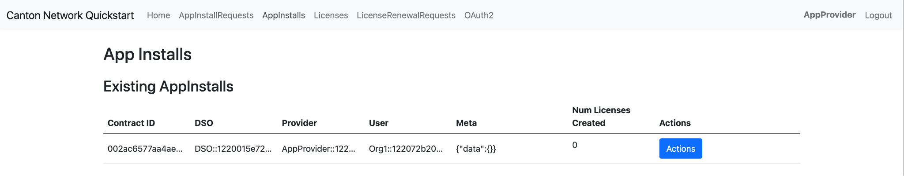

The usual browser-based developer inspection tools can extract the
relevant correlation ids:

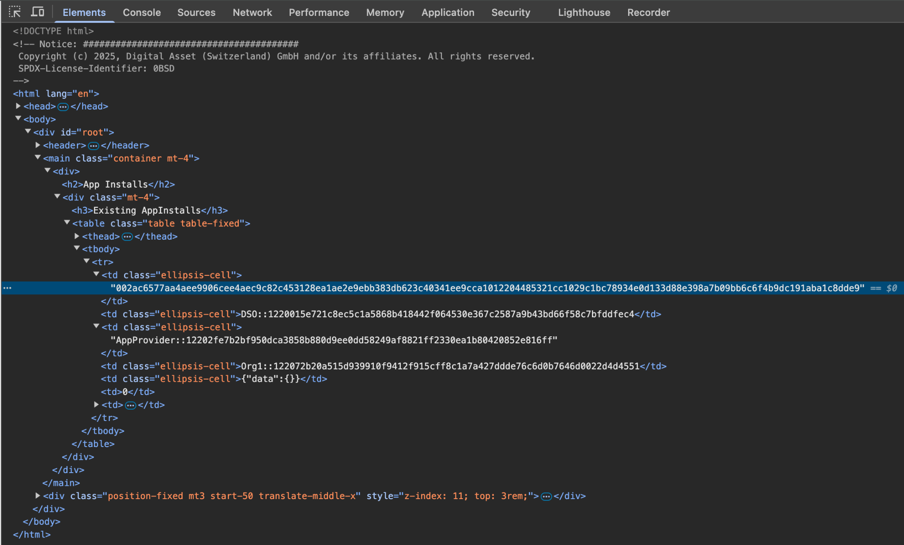

We can also see the HTTP call to the Backend-Service when we issue a new
license, and again the response to the call provides additional
identifiers.

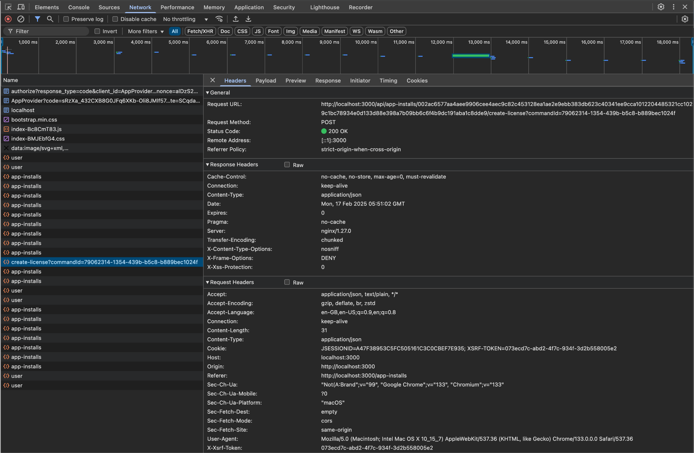

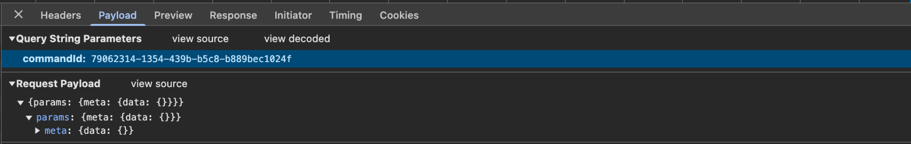

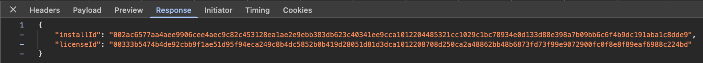

.. list-table::
   :widths: 20 20 60
   :header-rows: 1

   * - ``Id Type``
     - ``Description``
     - ``ID``
   * - ``Command Id``
     -
     - ``79062314-1354-439b-b5c8-b889bec1024f``
   * - ``Contract Id``
     - ``AppInstall``
     - ``002ac6577aa4aee9906cee4aec9c82c45312...``
   * - ``Contract Id``
     - ``License``
     - ``79062314-1354-439b-b5c8-b889bec1024f``

As we have already seen, contract ids can be used in Daml Shell to
inspect the contracts directly.
In addition, due to the way the OpenAPI interface for the Backend has been designed,
the Command Id is visible as a query parameter to the POST.
We can use this to query the consolidated logs in Grafana:

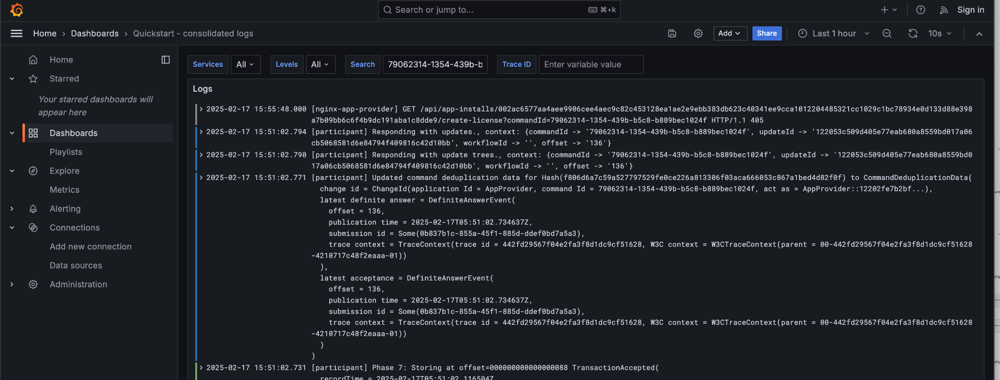

The command-id has provided logs from the App-Provider’s Nginx reverse
proxy in front of the backend and their Participant Node. We can verify
the Nginx log matches the request we saw from the browser:

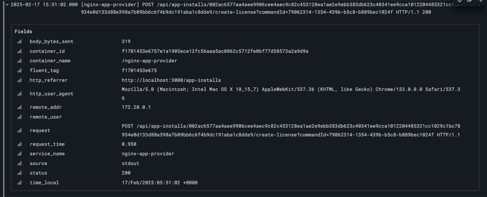

Critically, we can also see in the same aggregated log the entries that
indicate the Participant Node submitting the transaction to the Canton
Synchronization Domain:

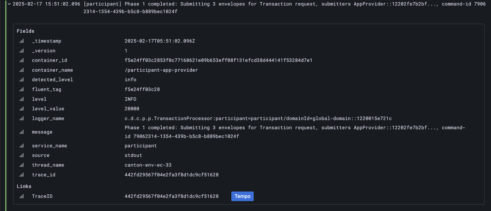

Was notified that the transaction was successfully committed to the
Canton Ledger:

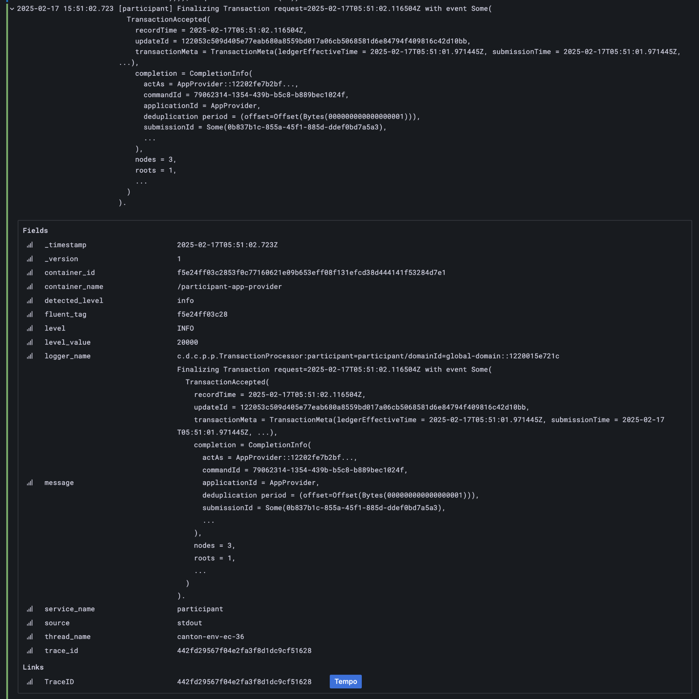

And finally added to the App-Provider’s local ledger: [10]_

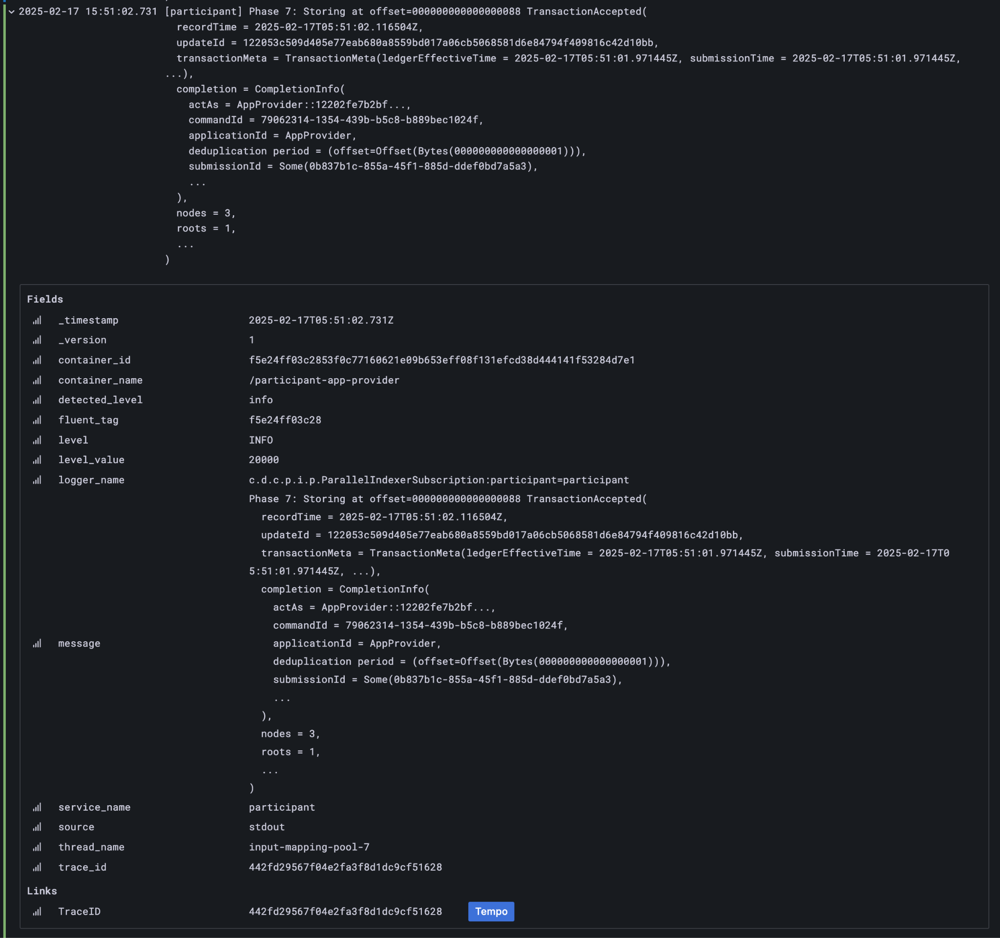

Note that from these we can obtain additional correlation ids, any of
which could have been used to find these log lines:

+------------+----------+----------------------------------------------+
| Ledger     |          | 000000000000000088                           |
| Offset     |          |                                              |
+============+==========+==============================================+
| T          |          | 122053c509d405e77eab680a855…2d10bb           |
| ransaction |          |                                              |
| Id         |          |                                              |
+------------+----------+----------------------------------------------+
| Submission |          | 0b837b1c-855a-45f1-885d-ddef0bd7a5a3         |
| Id         |          |                                              |
+------------+----------+----------------------------------------------+
| Trace Id   |          | 442fd29567f04e2fa3f8d1dc9cf51628             |
+------------+----------+----------------------------------------------+

In particular the Trace Id is invaluable because it can link us directly
into Tempo to see the distributed operation spans:

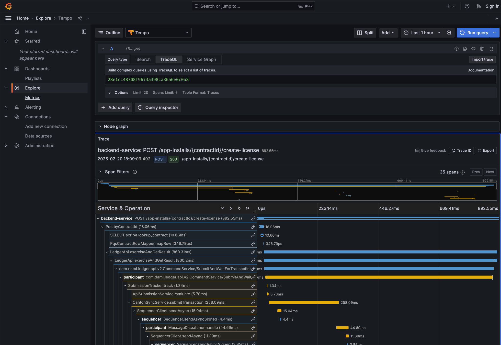

Here we can see the flow of the create license operation behind the
backend reverse proxy:

-  Initial POST handler in the Backend Service

-  Backend query against PQS to retrieve the AppInstall contract

-  Call to the App-Provider Ledger API from the Backend Service

-  Preparation of the Transaction by the Participant Node and submission
   to the Canton Network

One very powerful aspect of the Grafana suite is the degree to which it
integrates the various observability tools in the quickstart stack. We
have already seen this with the link from the consolidated logs to
Tempo; however, it also runs the other way. Expanding a span in Tempo
provides a link to “Logs for this span”.

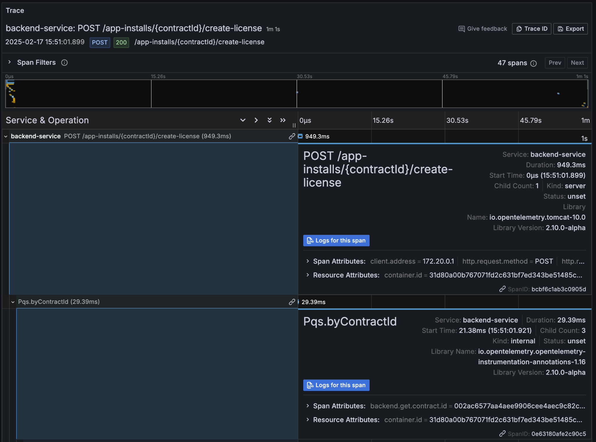

These link to the logs for the specific component (backend-service,
participant, sequencer, etc) correlated to this span.

Using different correlation ids can allow us to navigate and explore the
history of our distributed application. We have seen the transaction
committed to the ACS within the participant node; however, PQS also logs
identifiers associated with the transactions it indexes.

The transactionId and the traceId can both be used to broaden our
understanding of the create-license backend operation and what followed
after.

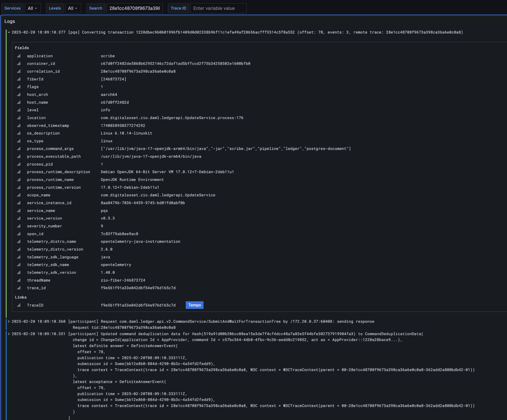

PQS ingestion is a distinct operation performed by a background process.
The traceId for this log is therefore distinct; however it still links
back to the trace and transaction identifiers associated with the ledger
data it is ingesting. You can see this if you follow the Tempo link:

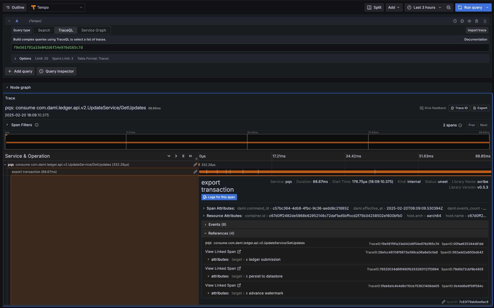

The expanded “references” section in the “export transaction” span
include links to traces for related PQS processes and also, critically,
the trace for command submission that resulted in the transaction. The
link takes us directly to that trace, which in this case is the same one
we just came from.

Querying and navigating through correlated logs, traces, and spans makes
understanding the multiple moving parts involved in a Canton Network
Application much easier. Keep in mind that you can only navigate logs
and traces that have been emitted; and, query identifiers that have been
included or attached. Therefore we highly recommend you periodically
take the time to look for opportunities to enrich and expand the logging
within your application.

One final thing that isn’t visible immediately, but is whenever you
hover over any log line is the option to view the log context for that
line:

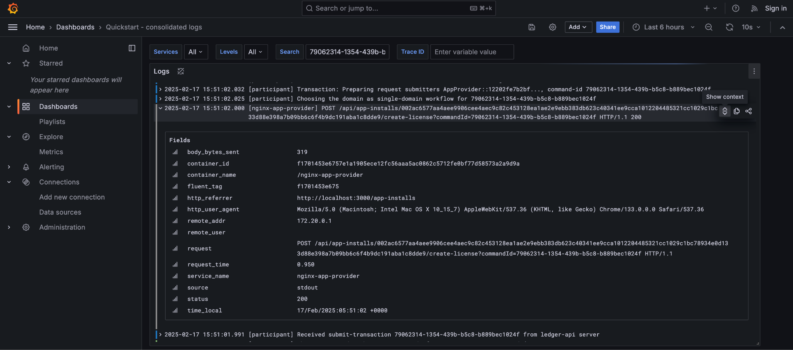

This will pop up a window with a full unfiltered view of the component’s
logs for that time, with the relevant line highlighted. In the case of
the Nginix log line, this provides a single click view of the other
traffic being served at the same time:

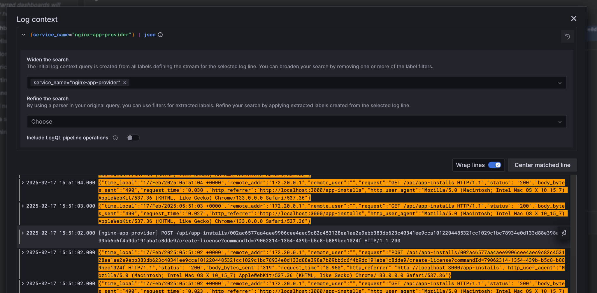

It is also worth keeping in mind that Grafana exposes access to the raw
queries for Tempo and Loki, and also Prometheus (not shown). It is well
worth the time to experiment with these and discover how to probe the
unified metrics, traces, and logs available via the observability stack:

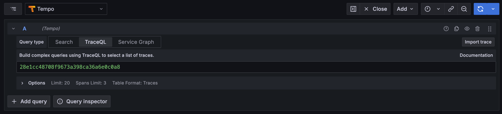

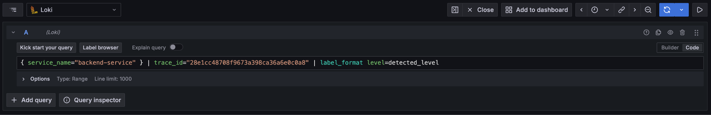

A starting point for finding documentation on these see:

-  Loki: https://grafana.com/docs/loki/latest/query/

-  Tempo: https://grafana.com/docs/tempo/latest/traceql/

-  Prometheus:
   https://grafana.com/docs/grafana/latest/datasources/prometheus/query-editor/

.. [1]
   Specifically this sends a ``CreateCommand`` to the ``submit-and-wait``
   service on the Application User’s participant node.

.. [2]
   See the Canton Network Quickstart Guide “Project Structure” for more
   details on this

.. [3]
   Daml shell has tab completion on most command arguments, including
   the Template Id argument to ``active`` and the Contract Id argument to
   contract.

.. [4]
   Further documentation is available at
   https://docs.daml.com/tools/daml-shell/index.html

   .. image:: images/footnote-04-daml-shell-cli.png
      :alt: "Daml Shell command line interface"

.. [5]
   A key differentiator of Canton from all other level one blockchains
   is that it offers privacy. It does this by enforcing right-to-know.
   rather than via secrecy-via-obscurity and/or via pseudo-anonymity.
   Canton provides two privacy guarantees: Even in encrypted form
   (sub-)transactions are only transmitted to participant nodes with a
   right to be informed of them; and, participant nodes will be informed
   of every (sub-)transaction they have a right to be informed of. For
   details on how Canton defines “right” and other aspects of this see
   the Daml Ledger Privacy Model
   (https://docs.daml.com/concepts/ledger-model/ledger-privacy.html#privacy)

.. [6]
   Distributed tracing is essential to efficient debugging and diagnosis
   of any distributed application. While technically distinct
   identifiers Trace and Span Ids are closely linked. If unfamiliar with
   their use OpenTelemetry has a good primer
   (https://opentelemetry.io/docs/concepts/signals/traces/), Grafana has
   a reasonable demo
   (https://grafana.com/docs/tempo/latest/introduction/), and we
   demonstrate their use later in this guide.

.. [7]
   Equivalent to “blockheight” in other public blockchains that do not
   support privacy. As privacy dictates that each participant node sees
   a different projection of the global blockchain, the offset is not
   comparable across different Participant Nodes. It is commonly the
   preferred id when dealing with a single participant node due to being
   a simple, monotonic, total-order on ledger events witnessed by a
   Participant Node.

.. [8]
   By virtue of their role in the ledger model, all parties are (and the
   associated entity must be) capable of authorizing a (sub-)transaction
   or ledger event. See the Daml Ledger Authorization Model for details
   (https://docs.daml.com/concepts/ledger-model/ledger-integrity.html#authorization)

.. [9]
   Where loggers cannot be configured to emit structured logs directly,
   log parsers are used to convert raw log files in the usual manner.
   This is primarily done in the OTEL Collector configuration.

.. [10]
   This is an example of an important feature of the Canton Network. The
   participant node is only aware of the existence of this transaction
   because it is authorized to be informed of the transaction by the
   relevant Daml Smart Contracts and the privacy semantics of the Daml
   Ledger Model. Privacy is guaranteed, not because the contract data is
   obscured as cyphertext; but, because the ledger model ensures
   participants without a verified right to know do not receive the
   transaction in any form.
