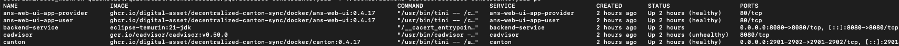
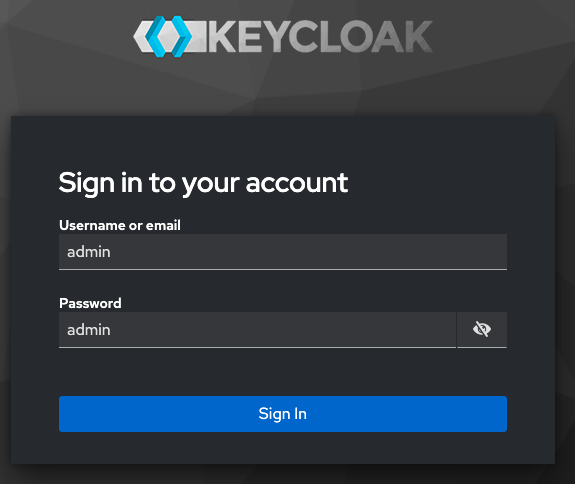
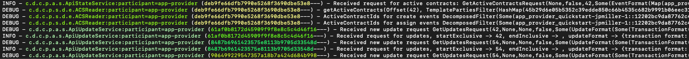
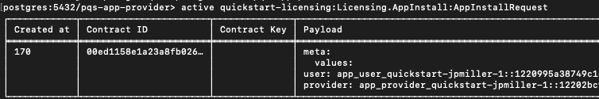
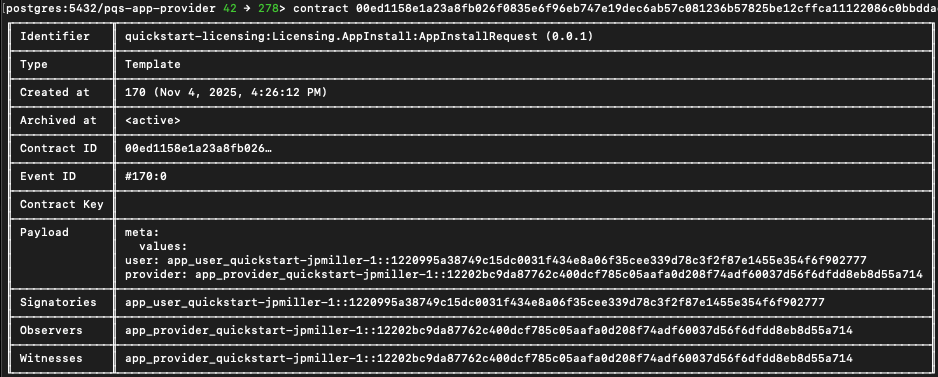
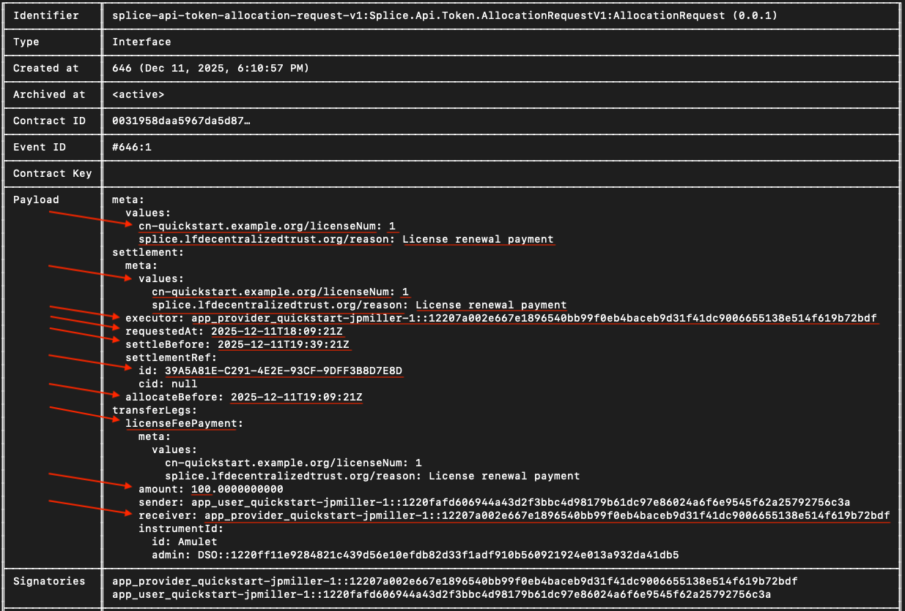

.. _quickstart-json-ledger-api:

Using the JSON Ledger API
=========================

Overview
--------

You are ready to extend the CN Quickstart to interact directly with your LocalNet.
You'll learn how to programmatically create parties, upload DARs, create contracts,
and integrate with Canton Coin (Amulet) using OAuth2 authentication against your running LocalNet.
By the end, you'll have the hands-on experience with critical API patterns needed to build your own Canton Network applications.

Prerequisites
-------------

This guide requires the Digital Asset Package Manager.
Follow installation instructions at `DPM <https://docs.digitalasset.com/build/3.5/dpm/dpm.html>`__.
(Exception: if you're running Daml 3.3, then use the `Daml Assistant <https://docs.digitalasset.com/build/3.3/component-howtos/smart-contracts/assistant.html>`__.)

You should have also finished the Quickstart installation and Explore the demo tutorial.
We also recommend reading the developer journey lifecycle to better understand how Quickstart bootstraps your Canton Network development by providing the tooling you will need for any CN app.

LocalNet interaction expectations vs Explore the demo (using app vs developer skills)
-------------------------------------------------------------------------------------

In the demo, you interacted with LocalNet through the web interface as a user.
Now you'll take control of LocalNet directly through APIs,
learning to programmatically manage the network infrastructure that will become your foundation for building on ScratchNet, TestNet, and beyond.

Project directory structure
---------------------------

The CN Quickstart contains the following directory structure:

.. code-block:: text

   cn-quickstart/
   ├── daml/                  # daml contracts and project files
   │   ├── User.daml          # user management
   │   ├── Provider.daml      # license provider  
   │   └── License.daml       # license management
   ├── backend/               # API integration points
   ├── frontend/              # UI 
   └── config/                # LocalNet settings, including OAuth2 and port settings

You'll work primarily in daml/ to extend the licensing contracts with a new LicenseHistory.daml contract that tracks ownership transfers

LocalNet env & auth
-------------------

Env verification
~~~~~~~~~~~~~~~~

The Quickstart application should be built and running. Verify that all services are operational in the terminal with ``make status``.

Port mappings
~~~~~~~~~~~~~

Security consideration
^^^^^^^^^^^^^^^^^^^^^^

The port mappings for ``LocalNet`` expose the ``AdminAPI`` port and the ``Postgres`` port,
both of which would normally be a security risk.
However, having direct access to these ports when running on a local developer's machine can be useful.
These ports should not be exposed when preparing deployment configurations for non-local deployments.
The port suffixes are defined as environment variables.
For any port mappings you wish to disable,
you can find and remove the relevant Docker ``port``: entry in the appropriate file.

JSON API ports
^^^^^^^^^^^^^^

(2975, 3975, 4975): Daml ops and smart contract deployment

Validator API ports
^^^^^^^^^^^^^^^^^^^

(2903, 3903, 4903): status monitoring

OAuth2 & token mgmt
~~~~~~~~~~~~~~~~~~~

Overview
^^^^^^^^

LocalNet uses Keycloak at http://keycloak.localhost:8082 for OAuth2 authentication with two realms: ``AppUser`` and ``AppProvider``.
You can login to Keycloak at this port by using the username and password ``admin``.
Read ``ref:keycloak-in-cnqs`` To learn more about Keycloak.

JSON API Tutorial
-----------------

In this tutorial, you're making API calls to simulate the steps taken in the Quickstart web app by requesting JWT tokens,
then include them as Bearer tokens in API calls.
Start the application and tools from the ``quickstart/`` directory.

Begin capture logs
~~~~~~~~~~~~~~~~~~

``make capture-logs``

Allow capture logs to run in its terminal window.
In a new terminal window, run the Quickstart application with ``make start``.
Once complete, this can become your working terminal window.
After ``make start`` completes, open a new terminal window to initiate lnav.
Start lnav with ``lnav logs/*.clog`` to capture and analyze logs.
If there are no clogs you might try running ``make stop && make clean-all`` then rerunning ``make start``.
Alternatively, you can begin this guide to make transactions on the ledger.
This should cause clogs to self-generate.
This command launches lnav to trace transactions, debug issues, and monitor system behavior as you work.
Keep lnav running in its terminal window.

Lnav Guidance
^^^^^^^^^^^^^

For detailed guidance on navigating lnav, and understanding the custom format, see ``Debugging and troubleshooting with lnav``.

Get a Token
~~~~~~~~~~~

Use the AppUser validator client to get a token.

.. code-block:: bash

   export USER_ADMIN_TOKEN=$(curl -fsS "http://keycloak.localhost:8082/realms/AppUser/protocol/openid-connect/token" \
     -H "Content-Type: application/x-www-form-urlencoded" \
     -d "client_id=app-user-validator" \
     -d "client_secret=6m12QyyGl81d9nABWQXMycZdXho6ejEX" \
     -d "grant_type=client_credentials" \
     -d "scope=openid" | jq -r .access_token)

(client_secret is set in oauth2.env and AppUser-realm.json)

An empty return indicates success.

Verify the token

.. code-block:: bash

   echo $USER_ADMIN_TOKEN

Use the token
~~~~~~~~~~~~~

List existing parties and include the token in API requests

.. code-block:: bash

   curl -H "Authorization: Bearer $USER_ADMIN_TOKEN" \
     http://localhost:2975/v2/parties

View Party and DSO activity in lnav
~~~~~~~~~~~~~~~~~~~~~~~~~~~~~~~~~~~~

View Party activity in lnav with the ``filter-in`` command followed by the app provider or app user IDs.

.. code-block:: text

   :filter-in APP_PROVIDER_ID

You can also view DSO activity in lnav using the DSO ID.

.. code-block:: text

   :filter-in DSO_ID

Save the ``party`` values for ``app-provider`` as APP_PROVIDER_PARTY and ``app-user`` as APP_USER_PARTY.

.. code-block:: bash

   APP_PROVIDER_PARTY=$(curl -s -H "Authorization: Bearer $USER_ADMIN_TOKEN" http://localhost:2975/v2/parties | \
     jq -r '.partyDetails[] | select(.party | startswith("app_provider_quickstart-")) | .party')
   
   APP_USER_PARTY=$(curl -s -H "Authorization: Bearer $USER_ADMIN_TOKEN" http://localhost:2975/v2/parties | \
     jq -r '.partyDetails[] | select(.party | startswith("app_user_quickstart-")) | .party')
   
   echo "APP_PROVIDER_PARTY: $APP_PROVIDER_PARTY"
   echo "APP_USER_PARTY: $APP_USER_PARTY"

Save the DSO Party
~~~~~~~~~~~~~~~~~~

.. code-block:: bash

   DSO_PARTY=$(curl -s "http://localhost:2975/v2/parties" \
     -H "Authorization: Bearer $USER_ADMIN_TOKEN" | \
     jq -r '.partyDetails[] | select(.party | startswith("DSO::")) | .party')
   echo "DSO Party: $DSO_PARTY"

You're now ready to make authenticated JSON API calls to your LocalNet.

Token management troubleshooting
~~~~~~~~~~~~~~~~~~~~~~~~~~~~~~~~~

Tokens expire after a period. If API calls return ``Cannot iterate over null`` or ``401 Unauthorized``,
regenerate your token with the command above. For production patterns,
see ``quickstart/docker/modules/splice-onboarding/docker/utils.sh`` for token management utilities.

Create a party
--------------

Create a new party on the AppUser validator.

.. code-block:: bash

   curl -X POST http://localhost:2975/v2/parties \
     -H "Authorization: Bearer $USER_ADMIN_TOKEN" \
     -H "Content-Type: application/json" \
     -d '{
       "partyIdHint": "Alice"
     }'

You can use any name as the ``partyIdHint`` value.
Canton may append additional characters for uniqueness.

Success Response:

.. code-block:: json

   {
     "partyDetails": {
       "party": "Alice::122091f5d8d174bc0d624616d4f366904f8d4c56d56e33508878db3156c3dd9b8ae9",
       "isLocal": true,
       "localMetadata": { "resourceVersion": "0", "annotations": {} },
       "identityProviderId": ""
     }
   }

See the new participant Alice in lnav
~~~~~~~~~~~~~~~~~~~~~~~~~~~~~~~~~~~~~~

.. code-block:: text

   :filter-in: Alice

or

.. code-block:: text

   :filter-in: ALICE_ID

Troubleshoot common party creation issues
~~~~~~~~~~~~~~~~~~~~~~~~~~~~~~~~~~~~~~~~~~

``A security-sensitive error has been received`` or ``401 Unauthorized``: Token expired - regenerate with the OAuth2 command

``INVALID_ARGUMENT``, ``Party already exists``, or ``400 Bad Request``: Party might already exist - check with:

.. code-block:: bash

   curl -X GET http://localhost:2975/v2/parties \
     -H "Authorization: Bearer $USER_ADMIN_TOKEN"

Upload a DAR
------------

Upload the prebuilt licensing DAR to the validator.

.. code-block:: bash

   curl -X POST http://localhost:2975/v2/packages \
     -H "Content-Type: application/octet-stream" \
     -H "Authorization: Bearer $USER_ADMIN_TOKEN" \
     --data-binary @./daml/licensing/.daml/dist/quickstart-licensing-0.0.1.dar

Success looks like:

.. code-block:: json

   {}

DAR Upload issues
~~~~~~~~~~~~~~~~~

404 Not Found: Verify DAR path is correct from your current directory
413 Payload Too Large: DAR exceeds size limit
409 Conflict: Package already uploaded
curl: (52) Empty reply from server: Network issue - retry
Check lnav for detailed upload logs and any processing errors.

Create a contract on LocalNet
------------------------------

Inspect the DAR to find the package hash. Find and save the package ID, a 64-character hex string.

.. code-block:: bash

   dpm damlc inspect-dar daml/licensing/.daml/dist/quickstart-licensing-0.0.1.dar

We suggest copying and pasting this command for your convenience.
If you choose to type it out, you may need to type the full directory without the use of autocomplete.

The desired value may vary between SDK versions.
You can identify the main package by the project name in the package list.

The format follows:

.. code-block:: text

   <project-name>-<version>-<package-id>

At the time of publication, the repeating string of ``b59ffbf847ac36fee1a4a743864274c5d8ab6f02ea8899f49fb5347e9978543f`` is the project ID that we seek.

Alternatively, if you're querying the ``quickstart-licensing`` DAR, as we do in this tutorial, you can quickly grep and save the project ID with:

.. code-block:: bash

   PACKAGE_ID=$(dpm damlc inspect-dar daml/licensing/.daml/dist/quickstart-licensing-0.0.1.dar | grep "quickstart-licensing-0.0.1-" | grep -v "dalf" | tail -1 | awk '{print $2}' | tr -d '"')
   
   echo $PACKAGE_ID

If you'd like to query a different DAR then change the file path.

See the DAR activity in ``lnav`` by filtering the package ID
~~~~~~~~~~~~~~~~~~~~~~~~~~~~~~~~~~~~~~~~~~~~~~~~~~~~~~~~~~~~~

.. code-block:: text

   :filter-in PACKAGE_ID

Create the Contract
~~~~~~~~~~~~~~~~~~~

Renew your token to query the participant:

.. code-block:: bash

   USER_ADMIN_TOKEN=$(curl -fsS "http://keycloak.localhost:8082/realms/AppUser/protocol/openid-connect/token" \
     -H 'Content-Type: application/x-www-form-urlencoded' \
     -d 'client_id=app-user-validator' \
     -d 'client_secret=6m12QyyGl81d9nABWQXMycZdXho6ejEX' \
     -d 'grant_type=client_credentials' \
     -d 'scope=openid' | jq -r .access_token)

Get PROVIDER_ADMIN_TOKEN
~~~~~~~~~~~~~~~~~~~~~~~~

.. code-block:: bash

   PROVIDER_ADMIN_TOKEN=$(curl -f -s -S "http://keycloak.localhost:8082/realms/AppProvider/protocol/openid-connect/token" \
     -H 'Content-Type: application/x-www-form-urlencoded' \
     -d 'client_id=app-provider-validator' \
     -d 'client_secret=AL8648b9SfdTFImq7FV56Vd0KHifHBuC' \
     -d 'grant_type=client_credentials' \
     -d 'scope=openid' | jq -r .access_token)

Get the user token:

.. code-block:: bash

   USER_TOKEN=$(curl -f -s -S "http://keycloak.localhost:8082/realms/AppUser/protocol/openid-connect/token" \
     -H 'Content-Type: application/x-www-form-urlencoded' \
     -d 'client_id=app-user-unsafe' \
     -d 'username=app-user' \
     -d 'password=abc123' \
     -d 'grant_type=password' \
     -d 'scope=openid' | jq -r .access_token)

Create the ``AppInstallRequest``:

.. code-block:: bash

   curl -X POST "http://localhost:2975/v2/commands/submit-and-wait" \
     -H "Authorization: Bearer $USER_TOKEN" \
     -H "Content-Type: application/json" \
     -d '{
       "commands": [{
         "CreateCommand": {
           "templateId": "'"$PACKAGE_ID"':Licensing.AppInstall:AppInstallRequest",
           "createArguments": {
             "provider": "'"$APP_PROVIDER_PARTY"'",
             "user": "'"$APP_USER_PARTY"'",
             "meta": {"values": {}}
           }
         }
       }],
       "workflowId": "install-request",
       "applicationId": "'"$APP_USER_ID"'",
       "commandId": "req-'"$(date +%s%N)"'",
       "deduplicationPeriod": {"Empty": {}},
       "actAs": ["'"$APP_USER_PARTY"'"],
       "readAs": [],
       "submissionId": "install-request",
       "disclosedContracts": [],
       "domainId": "",
       "packageIdSelectionPreference": []
     }'

The return shows your first contract made on LocalNet via the JSON API ledger!

The return looks something like:

.. code-block::

   {
     "updateId": "122059bdefac3665d7a0e933017e8b4f68b5668945ca3ecca219bee89741f10b28b1",
     "completionOffset": 1666
   }

updateId: A unique identifier for this ledger update/transaction. You can use this to track this specific operation in logs.
completionOffset: The position in the ledger where this transaction was committed.
For example, 1666 means this was the 1,666th transaction on this participant.

See the contract creation in lnav by filtering for ``AppInstallRequest`` or filter by the ``updateId`` value.

.. code-block:: text

   :filter-in AppInstallRequest

The results show detailed information including the trace IDs. Trace IDs can be used to follow related activity throughout the complete business operation.

In this screenshot, ``deb9fe66dfb7990e5268f3690dbe53e8`` and ``61af0b8172d45909f9f8e8c5c4d46f16`` are examples of trace IDs.

Access the contract in daml shell
~~~~~~~~~~~~~~~~~~~~~~~~~~~~~~~~~~

Open ``daml shell`` to query for the created contract.
In a new terminal window, from the ``quickstart/`` directory run ``make shell``

Query the ``AppInstallRequest`` contract:

.. code-block:: text

   active quickstart-licensing:Licensing.AppInstall:AppInstallRequest

Use the displayed portion of the contract ID to display the contract details.

In ``daml shell`` run the command contract followed by your unique Contract ID.
In this case: ``contract 0044e9b`` until there are no other contract options.
Press tab to complete the contract ID and enter to see the contract details.

Copy and save the contract ID to a new ``INSTALL_REQ_CID`` variable in the previous working terminal.

.. code-block:: bash

   INSTALL_REQ_CID="###"

Find the AppInstallRequest contract
~~~~~~~~~~~~~~~~~~~~~~~~~~~~~~~~~~~~

Get the provider user token as a password grant for party rights.

.. code-block:: bash

   PROVIDER_TOKEN=$(curl -f -s -S "http://keycloak.localhost:8082/realms/AppProvider/protocol/openid-connect/token" \
     -H 'Content-Type: application/x-www-form-urlencoded' \
     -d 'client_id=app-provider-unsafe' \
     -d 'username=app-provider' \
     -d 'password=abc123' \
     -d 'grant_type=password' \
     -d 'scope=openid' | jq -r .access_token)

Exercise the Accept choice on the first contract:

.. code-block:: bash

   JSON_PAYLOAD=$(cat <<EOF
   {
     "commands": [{
       "ExerciseCommand": {
         "templateId": "$PACKAGE_ID:Licensing.AppInstall:AppInstallRequest",
         "contractId": "$INSTALL_REQ_CID",
         "choice": "AppInstallRequest_Accept",
         "choiceArgument": {
           "installMeta": {"values": {}},
           "meta": {"values": {}}
         }
       }
     }],
     "workflowId": "accept-install",
     "applicationId": "app-provider-app",
     "commandId": "accept-$(date +%s%N)",
     "actAs": ["$APP_PROVIDER_PARTY"],
     "readAs": [],
     "submissionId": "accept-install",
     "disclosedContracts": [],
     "domainId": "",
     "packageIdSelectionPreference": []
   }
   EOF
   )
   
   curl -X POST "http://localhost:3975/v2/commands/submit-and-wait" \
     -H "Authorization: Bearer $PROVIDER_TOKEN" \
     -H "Content-Type: application/json" \
     -d "$JSON_PAYLOAD"

SUCCESS looks like ``{"updateId":"1220064a62356625ab7338564daedd21487749a7fcd21ad1d3a659b9131e9aadc246","completionOffset":109}%``

See the contract in lnav
~~~~~~~~~~~~~~~~~~~~~~~~

.. code-block:: text

   :filter-in appinstallrequest

You can exercise the accept choice exactly once.
After that you will receive an error because the contract has been accepted.

Generate a token for the app provider
~~~~~~~~~~~~~~~~~~~~~~~~~~~~~~~~~~~~~~

.. code-block:: bash

   PROVIDER_ADMIN_TOKEN=$(curl -fsS "http://keycloak.localhost:8082/realms/AppProvider/protocol/openid-connect/token" \
     -H 'Content-Type: application/x-www-form-urlencoded' \
     -d 'client_id=app-provider-validator' \
     -d 'client_secret=AL8648b9SfdTFImq7FV56Vd0KHifHBuC' \
     -d 'grant_type=client_credentials' \
     -d 'scope=openid' | jq -r .access_token)

Check if ``app-provider`` user exists

.. code-block:: bash

   curl -s "http://localhost:3975/v2/users" \
     -H "Authorization: Bearer $PROVIDER_ADMIN_TOKEN" | jq '.users[] | select(.metadata.annotations.username == "app-provider")'

If the ``app-provider`` user exists, get the party and verify it's set (if it fails review the previous steps):

.. code-block:: bash

   APP_PROVIDER_USER_ID=$(curl -s "http://localhost:3975/v2/users" \
     -H "Authorization: Bearer $PROVIDER_ADMIN_TOKEN" | \
     jq -r '.users[] | select(.metadata.annotations.username == "app-provider") | .id')
   
   echo "APP_PROVIDER_USER_ID: $APP_PROVIDER_USER_ID"

The ``APP_PROVIDER_USER_ID`` should equal the "id" value.

Return to ``daml shell`` to query for the ``AppInstall`` contract ID
~~~~~~~~~~~~~~~~~~~~~~~~~~~~~~~~~~~~~~~~~~~~~~~~~~~~~~~~~~~~~~~~~~~~

.. code-block:: text

   active quickstart-licensing:Licensing.AppInstall:AppInstall

Use the ``contract`` command as before to isolate and copy the complete contract id.

Back to the shell terminal
~~~~~~~~~~~~~~~~~~~~~~~~~~

.. code-block:: bash

   APP_INSTALL_CID="..."

You may verify that all of your variables are set:

.. code-block:: bash

   echo "User Party: $APP_USER_PARTY"
   echo "Provider Party: $APP_PROVIDER_PARTY"
   echo "App Provider User ID: $APP_PROVIDER_USER_ID"
   echo "Provider Token: ${PROVIDER_TOKEN:0:50}..."
   echo "Package ID: $PACKAGE_ID"
   echo "DSO Party: $DSO_PARTY"
   echo "Contract ID: $APP_INSTALL_CID"

Check that the token is valid
~~~~~~~~~~~~~~~~~~~~~~~~~~~~~~

.. code-block:: bash

   curl -s "http://localhost:3975/v2/users/$APP_PROVIDER_USER_ID" \
     -H "Authorization: Bearer $PROVIDER_TOKEN" | jq .

A valid token shows the provider token meta data.

An invalid token may show "a security-sensitive error has been received"

.. code-block:: text

   curl -s "http://localhost:3975/v2/users/$APP_PROVIDER_USER_ID" \
     -H "Authorization: Bearer $PROVIDER_TOKEN" | jq

If needed, regenerate the session and then check that the token is valid, again.

.. code-block:: bash

   PROVIDER_TOKEN=$(curl -f -s -S "http://keycloak.localhost:8082/realms/AppProvider/protocol/openid-connect/token" \
     -H 'Content-Type: application/x-www-form-urlencoded' \
     -d 'client_id=app-provider-unsafe' \
     -d 'username=app-provider' \
     -d 'password=abc123' \
     -d 'grant_type=password' \
     -d 'scope=openid' | jq -r .access_token)

Exercise the CreateLicense choice
~~~~~~~~~~~~~~~~~~~~~~~~~~~~~~~~~~

.. code-block:: bash

   JSON_PAYLOAD=$(cat <<EOF
   {
     "commands": [{
       "ExerciseCommand": {
         "templateId": "$PACKAGE_ID:Licensing.AppInstall:AppInstall",
         "contractId": "$APP_INSTALL_CID",
         "choice": "AppInstall_CreateLicense",
         "choiceArgument": {
           "params": {
             "meta": {"values": {}}
           }
         }
       }
     }],
     "workflowId": "create-license",
     "applicationId": "app-provider-app",
     "commandId": "license-$(date +%s%N)",
     "actAs": ["$APP_PROVIDER_PARTY"],
     "readAs": [],
     "submissionId": "create-license",
     "disclosedContracts": [],
     "domainId": "",
     "packageIdSelectionPreference": []
   }
   EOF
   )
   
   curl -X POST "http://localhost:3975/v2/commands/submit-and-wait" \
     -H "Authorization: Bearer $PROVIDER_TOKEN" \
     -H "Content-Type: application/json" \
     -d "$JSON_PAYLOAD"

If you see an error "Contract could not be found with id then you have assigned an incorrect contract ID to a contractId variable.

.. code-block::

   {"code":"CONTRACT_NOT_FOUND","cause":"Contract could not be found with id 0093e43a6fe746a56fb38e02f897194764150545917f127c6eb2c96b69976d83f6ca111220e6f80978587f7b7cd8ebbd8e176b2bb976fc3a6d3c6762d6fb8aad8e3c210b9f","correlationId":"create-license","traceId":"1e8a0ba16a95ef0881b1edb46b6f177a","context":{"participant":"'app-provider'","category":"11","tid":"1e8a0ba16a95ef0881b1edb46b6f177a","definite_answer":"false","commands":"{readAs: [], deduplicationPeriod: {duration: 'PT30S'}, submittedAt: '2025-10-28T16:20:38.735022Z', submissionId: 'create-license', actAs: ['app_provider_quickstart-jpmiller-1::1220349240f3f941ea497e05c40ae2497f1f2684706c0212e8cba854510332676ed6'], commandId: 'license-1761668438670963000', userId: '553c6754-8879-41c9-ae80-b302f5af92c9', workflowId: 'create-license'}"},"resources":[["ErrorResource(CID)","0093e43a6fe746a56fb38e02f897194764150545917f127c6eb2c96b69976d83f6ca111220e6f80978587f7b7cd8ebbd8e176b2bb976fc3a6d3c6762d6fb8aad8e3c210b9f"]],"errorCategory":11,"grpcCodeValue":5,"retryInfo":null,"definiteAnswer":null}%

Success returns a new updateId and completionOffset.

.. code-block::

   {"updateId":"12209864eb06a5407b006e1ded12dbfa495bfedef74463a314000bbbd9e2e412d27e","completionOffset":2559}%

See the AppInstall request in lnav
~~~~~~~~~~~~~~~~~~~~~~~~~~~~~~~~~~

.. code-block:: bash

   :filter-in appinstall

Get the License contract ID in daml shell
~~~~~~~~~~~~~~~~~~~~~~~~~~~~~~~~~~~~~~~~~

Return to ``daml shell`` to get the License contract ID.

.. code-block:: bash

   active quickstart-licensing:Licensing.License:License

Copy the complete contract ID and return to the previous working terminal.

.. code-block:: bash

   contract ###...

Save the license contract ID in a variable
~~~~~~~~~~~~~~~~~~~~~~~~~~~~~~~~~~~~~~~~~~~

.. code-block:: bash

   LICENSE_CID="..."

Generate a unique renewal request
~~~~~~~~~~~~~~~~~~~~~~~~~~~~~~~~~~

.. code-block:: bash

   REQUEST_ID=$(uuidgen)
   REQUESTED_AT=$(date -u +"%Y-%m-%dT%H:%M:%SZ")
   PREPARE_UNTIL=$(date -u -v+60M +"%Y-%m-%dT%H:%M:%SZ")
   SETTLE_BEFORE=$(date -u -v+90M +"%Y-%m-%dT%H:%M:%SZ")

Set the license extension
~~~~~~~~~~~~~~~~~~~~~~~~~~

.. code-block:: bash

   LICENSE_EXTENSION_DAYS=30
   LICENSE_EXTENSION_MICROSECONDS=$((LICENSE_EXTENSION_DAYS * 24 * 60 * 60 * 1000000))

Create the license renewal request
~~~~~~~~~~~~~~~~~~~~~~~~~~~~~~~~~~~

If you receive a "security-sensitive error has been received" then renew the token as before.

As a sanity check you may preemptively renew the token.

.. code-block:: bash

   PROVIDER_TOKEN=$(curl -f -s -S "http://keycloak.localhost:8082/realms/AppProvider/protocol/openid-connect/token" \
     -H 'Content-Type: application/x-www-form-urlencoded' \
     -d 'client_id=app-provider-unsafe' \
     -d 'username=app-provider' \
     -d 'password=abc123' \
     -d 'grant_type=password' \
     -d 'scope=openid' | jq -r .access_token)

Set the COMMAND_ID variable
~~~~~~~~~~~~~~~~~~~~~~~~~~~

.. code-block:: bash

   COMMAND_ID="complete-$(date +%s%N)"

You have 15 minutes to allocate tokens and 30 minutes to complete the renewal request.

.. code-block:: bash

   JSON_PAYLOAD=$(cat <<EOF
   {
     "commands": [{
       "ExerciseCommand": {
         "templateId": "$PACKAGE_ID:Licensing.License:License",
         "contractId": "$LICENSE_CID",
         "choice": "License_Renew",
         "choiceArgument": {
           "requestId": "$REQUEST_ID",
           "licenseFeeInstrumentId": {
             "admin": "$DSO_PARTY",
             "id": "Amulet"
           },
           "licenseFeeAmount": "100.0",
           "licenseExtensionDuration": {
             "microseconds": $LICENSE_EXTENSION_MICROSECONDS
           },
           "requestedAt": "$REQUESTED_AT",
           "prepareUntil": "$PREPARE_UNTIL",
           "settleBefore": "$SETTLE_BEFORE",
           "description": "License renewal payment"
         }
       }
     }],
     "workflowId": "renew-license",
     "applicationId": "app-provider-app",
     "commandId": "$COMMAND_ID",
     "actAs": ["$APP_PROVIDER_PARTY"],
     "readAs": [],
     "submissionId": "renew-license",
     "disclosedContracts": [],
     "domainId": "",
     "packageIdSelectionPreference": []
   }
   EOF
   )
   
   curl -X POST "http://localhost:3975/v2/commands/submit-and-wait" \
     -H "Authorization: Bearer $PROVIDER_TOKEN" \
     -H "Content-Type: application/json" \
     -d "$JSON_PAYLOAD"

Success looks like: ``{"updateId":"122067883fdbb23d7395fabab7fc44703b3d588e44924fe1d33b45eebc116ecd94a5","completionOffset":220}%``

LicenseRenewalRequest
~~~~~~~~~~~~~~~~~~~~~

Return to daml shell to get the ``LicenseRenewalRequest`` contract ID

.. code-block:: bash

   active quickstart-licensing:Licensing.License:LicenseRenewalRequest

Execute the contract command to see the ``LicenseRenewalRequest`` contract details.

.. code-block:: bash

   contract ###...

Take note of the ``Payload`` field.
You'll use the metadata values to send the payment allocation in a future step.

Go back to the terminal and create a new ``RENEWAL_REQ_CID`` variable

.. code-block:: bash

   RENEWAL_REQ_CID="###"

Return to the ``daml shell``
~~~~~~~~~~~~~~~~~~~~~~~~~~~~~~

``LicenseRenewalRequest`` implements the ``AllocationRequest interface``.

The user must allocate 100 CC tokens to satisfy the payment.

.. code-block:: bash

   active splice-api-token-holding-v1:Splice.Api.Token.HoldingV1:Holding

If the return shows "<empty>", wait a couple minutes and try again.
(It can take up to 15 minutes).
This is normal Canton Network behavior due to how the Participant Query Store (PQS) works.
Before the holding, or any other on-ledger activity shows in the ``daml shell``,
the transaction must be processed on the ledger,
PQS polls the participant for new events and updates its database,
and after the sync completes the queries return the new data.

The value in ``amount`` needs to be more than 100 to complete this step.

In LocalNet, the Canton Wallet automatically replenishes tokens in each round.
If your amount shows less than 100,
then you most likely only need to wait a few minutes for the wallet to build up to a satisfactory amount.

Optional: If you'd like to view more details, call the Holding contract ID.

Navigate to the Canton Wallet UI at http://wallet.localhost:2000/allocations

Log in as ``app-user`` with password ``abc123``

In the demo, the allocation was completed for you via backend processes in the web app.
Now, we need to fill out the allocation request manually

You need to manually create an allocation for the daml shell allocation contract even if the UI shows an allocation request.

.. image:: images/json-api-create-allocation.png
   :alt: Create allocation manually

Use the ``Payload`` metadata mentioned above to fill in all the fields surrounded by red.

* **Transfer Leg ID:** ``licenseFeePayment``
* **Settlement Ref ID:** ``settlementRef.id``
* **Recipient:** ``receiver``
* **Executor:** ``executor``
* **Amount:** ``100``
* **Requested At:** ``requestedAt``
* **Settle before:** ``settleBefore``
* **Allocate before:** ``allocateBefore``

Add two custom entries for the Settlement meta and Transfer leg meta, each.

* **Key:** ``cn-quickstart.example.org/licenseNum``
* **Value:** ``1``
* **Key:** ``splice.lfdecentralizedtrust.org/reason``
* **Value:** ``License renewal payment``

Do NOT wrap values in quotes.
Canton Wallet adds escaped quotes.

Both key value pairs go in both meta options.

To find the necessary information,
look at the LicenseRenewalRequest contract ``payload`` field in daml shell.

For the times ``Requested At``, ``Settle before``, and ``Allocate before``,
you will need to manually enter a "." before the "Z" followed by six (6) "0"s.

For example, ``requestedAt: 2025-10-29T20:38:16Z`` becomes
``2025-10-29T20:38:16.000000Z``

Send the request once all information is complete.

Regenerate the provider token in case of security-sensitive errors
~~~~~~~~~~~~~~~~~~~~~~~~~~~~~~~~~~~~~~~~~~~~~~~~~~~~~~~~~~~~~~~~~~

Tokens automatically expire over time.
This is a security measure and no fault of your own if you experience such errors.

.. code-block:: bash

   PROVIDER_TOKEN=$(curl -f -s -S "http://keycloak.localhost:8082/realms/AppProvider/protocol/openid-connect/token" \
     -H 'Content-Type: application/x-www-form-urlencoded' \
     -d 'client_id=app-provider-unsafe' \
     -d 'username=app-provider' \
     -d 'password=abc123' \
     -d 'grant_type=password' \
     -d 'scope=openid' | jq -r .access_token)

Return to the terminal and get a user token
~~~~~~~~~~~~~~~~~~~~~~~~~~~~~~~~~~~~~~~~~~~~

.. code-block:: bash

   USER_TOKEN=$(curl -f -s -S "http://keycloak.localhost:8082/realms/AppUser/protocol/openid-connect/token" \
     -H 'Content-Type: application/x-www-form-urlencoded' \
     -d 'client_id=app-user-unsafe' \
     -d 'username=app-user' \
     -d 'password=abc123' \
     -d 'grant_type=password' \
     -d 'scope=openid' | jq -r .access_token)

Look up the Allocation Contract ID
~~~~~~~~~~~~~~~~~~~~~~~~~~~~~~~~~~~

Query for the allocation in ``daml shell``

.. code-block:: bash

   active splice-api-token-allocation-v1:Splice.Api.Token.AllocationV1:Allocation

Save the allocation contract ID as ALLOCATION_CID="###"

Double check that the license renewal request, allocation , and license contract IDs are different.
You may verify contract ID variables with values in ``daml shell``.

.. code-block:: bash

   echo "Renewal Request: $RENEWAL_REQ_CID"
   echo "Allocation: $ALLOCATION_CID"
   echo "License: $LICENSE_CID"
   echo "User Party: $APP_USER_PARTY"
   echo "Provider Party: $APP_PROVIDER_PARTY"
   echo "App Provider User ID: $APP_PROVIDER_USER_ID"
   echo "Provider Token: ${PROVIDER_TOKEN:0:50}..."
   echo "Package ID: $PACKAGE_ID"
   echo "DSO Party: $DSO_PARTY"
   echo "Contract ID: $APP_INSTALL_CID"

Renew the token
~~~~~~~~~~~~~~~

.. code-block:: bash

   PROVIDER_TOKEN=$(curl -fsS "http://keycloak.localhost:8082/realms/AppProvider/protocol/openid-connect/token" \
     -H 'Content-Type: application/x-www-form-urlencoded' \
     -d 'client_id=app-provider-unsafe' \
     -d 'username=app-provider' \
     -d 'password=abc123' \
     -d 'grant_type=password' \
     -d 'scope=openid' | jq -r .access_token)

Generate a unique command ID
~~~~~~~~~~~~~~~~~~~~~~~~~~~~~

.. code-block:: bash

   COMMAND_ID="complete-renewal-$(date +%s%N)"

Set the endpoint path to connect to the backend service to complete the license renewal
~~~~~~~~~~~~~~~~~~~~~~~~~~~~~~~~~~~~~~~~~~~~~~~~~~~~~~~~~~~~~~~~~~~~~~~~~~~~~~~~~~~~~~~~

A backend service is required for this step because the DSO and the user exchange information stored in ``lockedAmulet``.
This information is not available to the Provider and therefore cannot be accessed via the daml shell.

.. code-block:: bash

   ENDPOINT="http://localhost:8080/licenses/${LICENSE_CID}:complete-renewal"

Create a variable for the request body
~~~~~~~~~~~~~~~~~~~~~~~~~~~~~~~~~~~~~~~

.. code-block:: bash

   REQUEST_BODY=$(cat <<EOF
   {
     "renewalRequestContractId": "$RENEWAL_REQ_CID",
     "allocationContractId": "$ALLOCATION_CID"
   }
   EOF
   )

Make the request to complete the license renewal
~~~~~~~~~~~~~~~~~~~~~~~~~~~~~~~~~~~~~~~~~~~~~~~~~

.. code-block:: bash

   RESPONSE=$(curl -s -v -X POST "$ENDPOINT?commandId=$COMMAND_ID" \
     -H "Authorization: Bearer $PROVIDER_TOKEN" \
     -H "Content-Type: application/json" \
     -d "$REQUEST_BODY")
   
   
   echo "$RESPONSE" | jq .

Success ends in a ``licenseId``

.. code-block::

   {
     "licenseId": "###"
   }

After successful execution, return to daml shell and run a contract command using the new ``licenseId`` that was just returned to you.

.. code-block:: bash

   contract ###...
   
In the ``Payload`` field, notice that the ``expiresAt`` value is set for 30 days in the future.

Congratulations!
You've made a complete business operation in the Quickstart application using JSON API
(with minimal help from the backend service to collect information not available in PQS for ``complete-renewal``).

Appendix
--------

User token and IDs cookbook
~~~~~~~~~~~~~~~~~~~~~~~~~~~

.. code-block:: bash

   #!/bin/bash
   # Complete LocalNet Setup Script
   
   
   # 1. Get Admin Tokens (for querying users)
   USER_ADMIN_TOKEN=$(curl -fsS "http://keycloak.localhost:8082/realms/AppUser/protocol/openid-connect/token" \
     -H 'Content-Type: application/x-www-form-urlencoded' \
     -d 'client_id=app-user-validator' \
     -d 'client_secret=6m12QyyGl81d9nABWQXMycZdXho6ejEX' \
     -d 'grant_type=client_credentials' \
     -d 'scope=openid' | jq -r .access_token)
   
   
   PROVIDER_ADMIN_TOKEN=$(curl -fsS "http://keycloak.localhost:8082/realms/AppProvider/protocol/openid-connect/token" \
     -H 'Content-Type: application/x-www-form-urlencoded' \
     -d 'client_id=app-provider-validator' \
     -d 'client_secret=AL8648b9SfdTFImq7FV56Vd0KHifHBuC' \
     -d 'grant_type=client_credentials' \
     -d 'scope=openid' | jq -r .access_token)
   
   
   # 2. Discover User IDs and Party IDs
   APP_USER_USER_ID=$(curl -s "http://localhost:2975/v2/users" \
     -H "Authorization: Bearer $USER_ADMIN_TOKEN" | \
     jq -r '.users[] | select(.metadata.annotations.username == "app-user") | .id')
   
   
   APP_USER_PARTY=$(curl -s "http://localhost:2975/v2/users/$APP_USER_USER_ID" \
     -H "Authorization: Bearer $USER_ADMIN_TOKEN" | jq -r '.user.primaryParty')
   
   
   APP_PROVIDER_USER_ID=$(curl -s "http://localhost:3975/v2/users" \
     -H "Authorization: Bearer $PROVIDER_ADMIN_TOKEN" | \
     jq -r '.users[] | select(.metadata.annotations.username == "app-provider") | .id')
   
   
   APP_PROVIDER_PARTY=$(curl -s "http://localhost:3975/v2/users/$APP_PROVIDER_USER_ID" \
     -H "Authorization: Bearer $PROVIDER_ADMIN_TOKEN" | jq -r '.user.primaryParty')
   
   
   # 3. Get User Tokens (for party operations)
   USER_TOKEN=$(curl -f -s -S "http://keycloak.localhost:8082/realms/AppUser/protocol/openid-connect/token" \
     -H 'Content-Type: application/x-www-form-urlencoded' \
     -d 'client_id=app-user-unsafe' \
     -d 'username=app-user' \
     -d 'password=abc123' \
     -d 'grant_type=password' \
     -d 'scope=openid' | jq -r .access_token)
   
   
   PROVIDER_TOKEN=$(curl -f -s -S "http://keycloak.localhost:8082/realms/AppProvider/protocol/openid-connect/token" \
     -H 'Content-Type: application/x-www-form-urlencoded' \
     -d 'client_id=app-provider-unsafe' \
     -d 'username=app-provider' \
     -d 'password=abc123' \
     -d 'grant_type=password' \
     -d 'scope=openid' | jq -r .access_token)
   
   
   # 4. Get Package ID
   PACKAGE_ID=$(dpm damlc inspect-dar daml/licensing/.daml/dist/quickstart-licensing-0.0.1.dar | \
     grep "quickstart-licensing-0.0.1-" | grep -v "dalf" | tail -1 | awk '{print $2}' | tr -d '"')
   
   
   # 5. Display all variables
   echo "=== Setup Complete ==="
   echo "APP_USER_USER_ID: $APP_USER_USER_ID"
   echo "APP_USER_PARTY: $APP_USER_PARTY"
   echo "APP_PROVIDER_USER_ID: $APP_PROVIDER_USER_ID"
   echo "APP_PROVIDER_PARTY: $APP_PROVIDER_PARTY"
   echo "PACKAGE_ID: $PACKAGE_ID"
   echo ""
   echo "Tokens set (first 50 chars):"
   echo "USER_TOKEN: ${USER_TOKEN:0:50}..."
   echo "PROVIDER_TOKEN: ${PROVIDER_TOKEN:0:50}..."
   
   
   # Check if the user exists on the participant
   curl "http://localhost:2975/v2/users/92a520cb-2f09-4e55-b465-d178c6cfe5e4" \
     -H "Authorization: Bearer $USER_ADMIN_TOKEN"

Additional ports the default setup exposes
~~~~~~~~~~~~~~~~~~~~~~~~~~~~~~~~~~~~~~~~~~~

**Ledger API ports**
(2901, 3901, 4901): Canton Ledger API access

**Admin API ports**
(2902, 3902, 4902): system administration

Health checks
~~~~~~~~~~~~~

You can find the health check endpoints for each validator in ``quickstart/docker/modules/localnet/docker/splice/health-check.sh``.

Empty responses indicate healthy services.

.. code-block:: bash

   curl -f http://localhost:2903/api/validator/readyz  # App User
   curl -f http://localhost:3903/api/validator/readyz  # App Provider 
   curl -f http://localhost:4903/api/validator/readyz  # Super Validator

Access admin ports
~~~~~~~~~~~~~~~~~~

Admin ports are defined in ``quickstart/docker/modules/localnet/compose.yaml``

.. code-block:: bash

   curl -v http://localhost:2902/admin    # Would access App User admin if exposed
   curl -v http://localhost:3902/admin    # Would access App Provider admin if exposed

Show the Daml ledger API claims in your token
~~~~~~~~~~~~~~~~~~~~~~~~~~~~~~~~~~~~~~~~~~~~~~

.. code-block:: bash

   echo $USER_TOKEN | cut -d. -f2 | base64 -d 2>/dev/null | jq '."https://daml.com/ledger-api"'

How to discover the user and provider IDs
~~~~~~~~~~~~~~~~~~~~~~~~~~~~~~~~~~~~~~~~~~

AppUser and AppProvider validator, wallet admin, and other IDs are located in their respective oauth2.env files.

.. code-block:: bash

   # 1. Get admin token for the participant
   USER_ADMIN_TOKEN=$(curl -fsS "http://keycloak.localhost:8082/realms/AppUser/protocol/openid-connect/token" \
     -H 'Content-Type: application/x-www-form-urlencoded' \
     -d 'client_id=app-user-validator' \
     -d 'client_secret=6m12QyyGl81d9nABWQXMycZdXho6ejEX' \
     -d 'grant_type=client_credentials' \
     -d 'scope=openid' | jq -r .access_token)

.. code-block:: bash

   # 2. List all users to discover the wallet admin user
   curl -s "http://localhost:2975/v2/users" \
     -H "Authorization: Bearer $USER_ADMIN_TOKEN" | jq '.users[] | select(.metadata.annotations.username == "app-user")'

.. code-block:: bash

   # 3. Extract the user ID from the result
   APP_USER_ID=$(curl -s "http://localhost:2975/v2/users" \
     -H "Authorization: Bearer $USER_ADMIN_TOKEN" | jq -r '.users[] | select(.metadata.annotations.username == "app-user") | .id')

.. code-block:: bash

   # 4. Get the party ID for that user
   APP_USER_PARTY=$(curl -s "http://localhost:2975/v2/users/$APP_USER_ID" \
     -H "Authorization: Bearer $USER_ADMIN_TOKEN" | jq -r '.user.primaryParty')