.. _quickstart-debugging-and-troubleshooting-lnav:

=======================================
Debugging and troubleshooting with lnav
=======================================

.. contents:: Contents
   :depth: 2
   :local:
   :backlinks: top

Jumping In
==========

``lnav`` is a log file viewer and navigator that helps you view, search, filter, and analyze log files.
This section gets you started quickly with ``lnav`` in CN application development using LocalNet.
Screenshots and instructions are made with ``lnav version 0.13.1``.

lnav download & documentation
-----------------------------

Download ``lnav`` for your OS at the `lnav download page <https://lnav.org/downloads>`__.

You can check the location of ``lnav`` on your machine with ``which lnav``.
Display the version of ``lnav`` with ``lnav --version``.

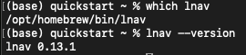

If you’re unfamiliar with lnav, read `their docs <https://docs.lnav.org/en/v0.13.1/>`__.

Install Canton lnav format
--------------------------

The Canton Network has a custom ``lnav`` configuration to help you view and analyze Canton logs.
The configuration is defined in JSON and lives in the open source Hyperledger Labs Splice repository.
You can read the schema to understand available values and the construction of logs when debugging with ``lnav`` in CN applications.

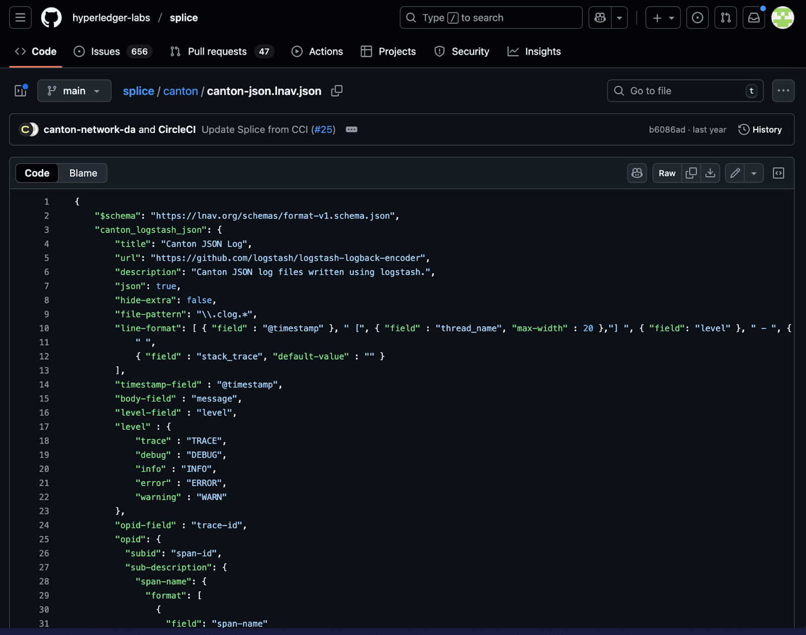

``splice/canton/canton-json.lnav.json``

Download the configuration and install it for ``lnav`` usage:

::

   curl -L https://raw.githubusercontent.com/hyperledger-labs/splice/main/canton/canton-json.lnav.json -o /tmp/canton-json.lnav.json && lnav -i /tmp/canton-json.lnav.json

Now you're ready to navigate CN logs with ``lnav``.

Capture Quickstart logs
=======================

To capture logs for all the quickstart containers, from the ``quickstart/`` directory, run ``make capture-logs``.
Allow the terminal running ``capture-logs`` to operate in the background.
Then, in a separate terminal run ``make start`` to launch the containers.

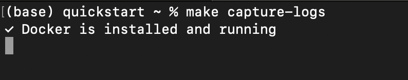

Start ``make capture-logs`` in terminal 1

Find the logs
=============

The containers create logs in the ``logs/`` directory while running, starting from initialization.
See the available logs by running ``ls logs``.

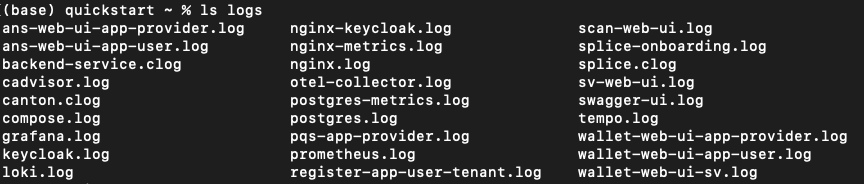

Canton logs
===========

``clog`` pronounced “c-log” are Canton logs that follow the custom Canton log formatting, as mentioned above.
``clogs`` are generally used for long-running services such as Canton and Splice, while the standard log files usually indicate initialization scripts and utilities.

View live ``clogs`` by running ``lnav logs/*.clog`` from the ``quickstart/`` directory.
(Exit at any time by pressing “q” or typing “:quit”)

The clogs show a live stream of logs emanating from Canton, Splice, and backend services.

Navigating events
=================

In the terminal, create a business event to trace by running ``make create-app-install-request`` from the ``quickstart/`` directory.

Return to ``lnav``.
Pause and unpause the stream as needed while working through this guide by pressing “=”.

Search for an event
-------------------

Create a search for “AppInstallRequest” by typing ``/AppInstallRequest``.

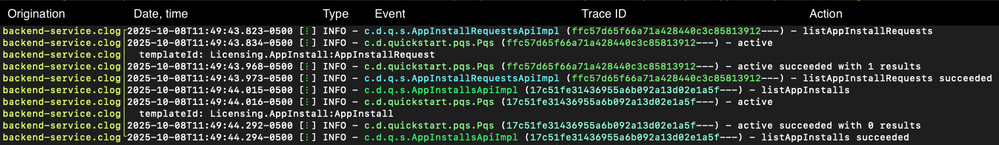

Use “n” and “shift + N” to jump through entries containing “AppInstallRequest”.
“>” and “<” scroll horizontally across long entries.

Press “shift + G” if you need to jump to recent entries.
This will resume the live stream, if unpaused.

Filter an event
---------------

To focus on events of interest, make a “filter-in” search with ``:filter-in AppInstallRequest``

Unlike search, which highlights matches within the log stream, ``:filter-in`` shows only log entries that contain the requested information.

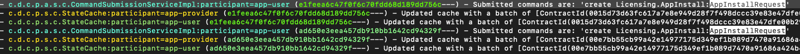

Clear filter-in results
-----------------------

Return to the live stream with ``:reset-session``.
If you return to a blank log, use ``q`` to quit and reenter ``lnav`` with ``lnav logs/*.clog``.

Generate events for analysis
----------------------------

Perform a complete business operation in the Quickstart application to generate traceable events for log analysis.

Quick workflow summary
----------------------

1. Log in as ``app-provider`` at ``localhost:3000``
2. Accept the install request
3. Create a license
4. Issue a license renewal request
5. Log in as ``app-user`` and make the payment in the Canton Wallet.
6. Accept and allocate payment for the renewal
7. Return to the app as ``app-provider`` and complete the renewal

For detailed step-by-step instructions with screenshots, see :ref:`quickstart-explore-the-demo`.

Search by Trace ID
==================

The logs include an `OpenTelemetry trace <https://opentelemetry.io/docs/concepts/signals/traces/>`__ identifier (trace-id) for analysis purposes.
A trace ID is useful since they are recorded with logs in different containers.
Trace IDs help you follow a single operation across all services.
This is a key log analysis technique that you will use frequently.

Find a Trace ID
---------------

Find a Trace ID by filtering with ``:filter-in listLicenses``
The Trace ID is the string of characters wrapped in the parentheses.

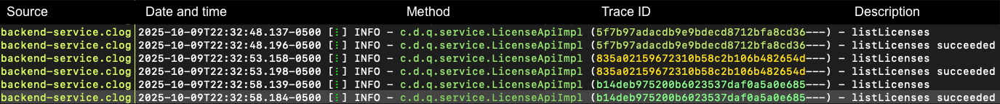

Select and copy the Trace ID of any entry.

For example, “835a02159672310b58c2b106b482654d”

.. warning:: Your trace ID will be unique. Copying this example will result in 0 results.

Filter by Trace ID
------------------

Filter to see only logs related to this specific Trace ID:

::

   :reset-session
   :filter-in 835a02159672310b58c2b106b482654d

Now, you can view all log entries across any containers that handled this request.

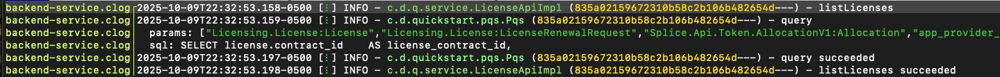

Alternatively, you can search for the trace ID without filtering:

::

   :reset-session
   /0f23f6d54af3176a6d4c904ed66e8702

This highlights all occurrences without hiding other logs.

Filter (``:filter-in``) - When you want to focus exclusively on one operation.
Search (``/``) - When you want context from surrounding logs.

Power Use of lnav
=================

The "Jumping In" and "Capture Quickstart logs" sections introduced you to ``lnav``.
This section introduces you to more powerful features for monitoring your Canton Network applications during development.

Integrate ``lnav`` into your workflow:

* **Development**: Monitor application behavior as you build features, verify that Daml contracts and workflows execute as expected, and catch and diagnose issues early.
* **Debugging**: Trace the flow of operations across Canton, Splice, and backend services, use trace IDs to understand the complete lifecycle of failed operations, and filter logs to isolate specific issues without noise from unrelated events.
* **Troubleshooting**: Quickly locate errors and warnings, search for specific operations, contract IDs, or party identifiers, and analyze the sequence of events leading to unexpected behavior.

The ability to effectively read and analyze logs is crucial for building robust Canton Network applications.
As your applications grow in complexity, ``lnav`` becomes an invaluable tool for understanding system behavior, identifying bottlenecks, and resolving issues efficiently.

Further exploration of lnav clogs
=================================

The remainder of this guide is intended to increase your familiarization with ``lnav``.
Practice the following commands while in ``lnav``.

Press “g” on the keyboard to go to the top of the logs. 
“Shift + g” takes you to the end of the logs and reinitiates the stream.

Pause and unpause the stream with “=”.

Use the left cursor key to view the log entry’s file origination point.

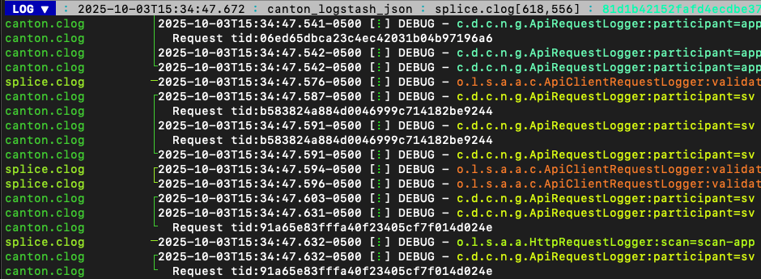

Use the right cursor key to view the log entry.

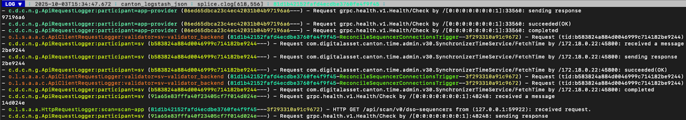

Using “shift + right” and “shift + left” moves the view in smaller increments.

Use “x” to expand and collapse information within the square brackets after the date.

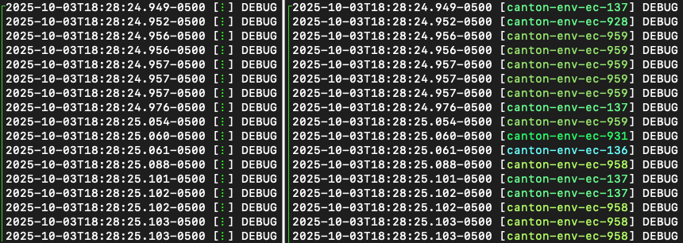

“CTRL + x” toggles cursor mode to move a cursor line.

Mark and copy lines
===================

* Use “m” to mark lines.
* Copy lines with “c” to mark and copy entries into clipboard.
* “m” and “c” allow you to easily share log entries of interest.
* “Shift + J” copies subsequent lines.
* “Shift + K” unmarks subsequent lines.
* “u” and “Shift + U” allows you to jump between marked lines
* “Shift + C” clears all marked lines.

Find errors, warnings, and trace IDs
====================================

* “e” and “Shift + E” jumps between errors
* “w” and “Shift + W” jumps between warning messages
* “o” and “Shift + O” jumps between traceIds (opId)

Time
====

“Shift + T” toggles time marks where the selected item is the center of time.
The smaller the digit the closer to the event the log is and the larger the number, the further from the event.
Time is demarcated in seconds.

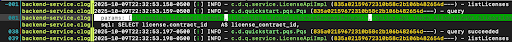

Command mode
============

As a Canton Network developer, command mode gives you precise control over log navigation,
filtering, and analysis-essential functions for isolating trace IDs, filtering by service component,
or narrowing down time windows when debugging distributed Canton operations.
This section highlights a few of the most commonly used commands.

Enter command mode with the colon key, “:” then type your desired command.

To scroll through command history, press “:” followed by the up arrow.

A small selection of available commands are showcased in the Appendix section below.
Read the ``lnav`` documentation for a full list of `available commands <https://docs.lnav.org/en/latest/commands.html#commands>`__.

Help
----

For detailed documentation of any command use ``:help`` or “?”.
Exit help with “q” or “?”

Prune logs
==========

From time to time you may desire to prune logs.
You can prune all logs and start with a fresh logs subdirectory with:

::
   
   docker rm -f $(docker ps -qa); docker system prune -f; docker volume prune -f; rm -r logs; mkdir logs

You need to run ``make start`` to resume operations after running this command.

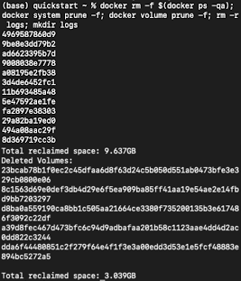

Troubleshooting
===============

If ``lnav`` crashes it may also force quit the capture logs script and delete all of the files in the ``logs/`` directory.

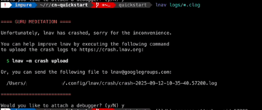

To rebuild ``logs/`` and its ``*.clogs`` files, 
you need to ``make stop && make clean-all`` and then ``make start`` from the ``quickstart/`` directory.

Appendix
========

Correlation mechanisms
----------------------

Canton Network uses several correlation and filtering mechanisms that can be used to search, sort, and analyze log entries:

* ``level`` - Log level (TRACE, DEBUG, INFO, WARN, ERROR)
* ``logger_name`` - Component identifier
* ``message`` - Log message content
* ``trace-id``: OpenTelemetry trace identifier
* ``span-id``: OpenTelemetry span identifier
* ``span-parent-id``: Links spans in trace hierarchy
* ``span-name``: Operation name
* ``@timestamp`` - Timestamp

Let’s look at examples to better understand each of these correlation mechanisms.

::

   2025-10-09T22:03:41.702-0500 [⋮] DEBUG - ⋮ (---) - ⋮

* Timestamp: ``2025-10-09T22:03:41.702-0500``
* Collapsed metadata including the thread_name: ``[⋮]``
* Log level: ``DEBUG``
* Separator: ``-``
* More collapsed content: ``⋮``
* No active trace (not part of distributed tracking): ``(---)``

::

   2025-10-09T22:22:08.976-0500 [⋮] DEBUG - ⋮ (846ff12a35f6e8b61171039527934709-SvOffboardingSequencerTrigger--6aaa9f37e9ae78c4) - ⋮

* Trace ID: ``846ff12a35f6e8b61171039527934709``
* Span name: ``SvOffboardingSequencerTrigger``
* Span ID: ``6aaa9f37e9ae78c4``

::

   2025-10-09T22:22:08.978-0500 [⋮] DEBUG - ⋮ (2a2f0baca0ce4452d713a30d9a5bcb7d---) - Request com.digitalasset.canton.topology.admin.v30.TopologyManagerReadService/ListSequencerSynchronizerState by /172.18.0.22:43954: received a message

* Trace ID: ``2a2f0baca0ce4452d713a30d9a5bcb7d``
* Log message: ``Request com.digitalasset.canton.topology.admin.v30.TopologyManagerReadService/ListSequencerSynchronizerState by /172.18.0.22:43954: received a message``
* The three hyphens ``---`` indicates that there is no span-name (it would be after the first of the three hyphens) and that there is no span-id (which would be after the final two hyphens).
* See the previous example to review how the trace-id, span-name, and span-id are formatted.

Advanced filtering
------------------

Common Field Reference
~~~~~~~~~~~~~~~~~~~~~~

The following structured fields are present in Canton Network logs and can be used in ``lnav`` filter expressions to search, sort, and analyze log entries.

Filter by Severity
~~~~~~~~~~~~~~~~~~

::

   :filter-in level = 'ERROR'
   :filter-out level = 'DEBUG'

Filter by Component
~~~~~~~~~~~~~~~~~~~

::

   :filter-in logger_name =~ '.*sequencer.*'
   :filter-in logger_name =~ '.*participant1.*'

Filter by Trace
~~~~~~~~~~~~~~~

::

   :filter-in trace-id = '2a2f0baca0ce4452d713a30d9a5bcb7d'
   :filter-in span-name =~ '.*Transfer.*'

Filter by Time Range
~~~~~~~~~~~~~~~~~~~~

::

   :filter-in @timestamp >= '2024-01-01 10:00:00'
   :filter-in @timestamp < '2024-01-01 11:00:00'

Filter by Content
~~~~~~~~~~~~~~~~~

::

   :filter-out message =~ 'health.*check'
   :filter-in message =~ 'license'

Hide lines
----------

You can hide lines that match specific patterns using the following commands:

* ``:hide-lines-before`` hides lines that come before the given date.
* ``:hide-lines-after`` hides lines that come after the given date.
* ``:hide-fields`` hides certain fields in each line.

You can hide fields types including ``logger_name``, ``thread_name``, 
``ipaddress``, ``@timestamp``, ``stack_trace``, ``span-parent-id``, ``trace-id``, ``@version``, and ``level``.
You can hide more than one field type at a time.

For example, if you wanted to hide ``thread_name`` and ``level`` you’d use:

``:hide-fields thread_name level``

Hide lines before
~~~~~~~~~~~~~~~~~

:: 

   ​​# Hide logs before a specific time
   ``:hide-lines-before 2025-10-10 14:30:00``

   # Hide logs before the last hour
   ``:hide-lines-before -1h``

   # Hide logs before a specific line number
   ``:hide-lines-before 1000``

Hide lines after
~~~~~~~~~~~~~~~~

::

   # Hide logs after a specific time
   :hide-lines-after 2025-10-10 16:00:00

   # Hide logs after a specific duration from start
   :hide-lines-after +2h

   # Hide logs after line 5000
   :hide-lines-after 5000

Show lines
~~~~~~~~~~

* ``:show-lines-before`` shows lines that were previously hidden before a specific time, duration, or line number.
* ``:show-lines-after`` shows lines that were previously hidden after a specific time, duration, or line number.

Gathering logs contents into a directory
----------------------------------------

Use one of the following commands from ``quickstart/``, based on your operating system, to gather the logs directory content into a single folder:

``tar -czf my-cn-logs.tar.gz logs/``

``zip -r my-cn-logs.zip logs/``

Common lnav shortcuts
---------------------

``lnav`` shortcuts can be found on ``lnav``’s `hotkey reference page <https://docs.lnav.org/en/latest/hotkeys.html>`__.

Navigation
~~~~~~~~~~

* j/k or ↓/↑ - Move down/up one line
* J/K - Select/deselect subsequent entries
* Space/b - Page down/up
* g/G - Go to top/bottom of file
* n/N - Next/previous search result

Search & Filter
~~~~~~~~~~~~~~~

* / - Search forward
* ? - Help menu
* f - Set filter expression
* F - Clear filters
* t - Display only errors/warnings
* T - Clear error filter

Time Navigation
~~~~~~~~~~~~~~~

* 7/8 - Skip to top of hour
* Shift+T - Toggle time view

Display
~~~~~~~

* v - Switch between log views
* Tab - Cycle through files and text filters menus
* i - Show/hide informational messages
* p - Toggle pretty-print mode

Bookmarks
~~~~~~~~~

* m - Set bookmark
* u/U - Next/previous bookmark

Other
~~~~~

* q - Quit
* ? - Help (shows all shortcuts)
