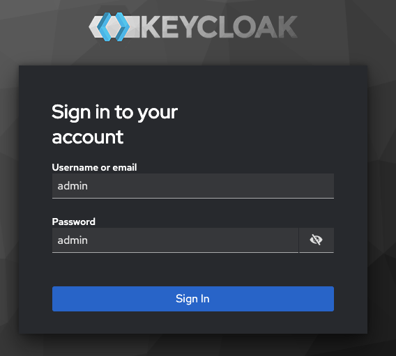
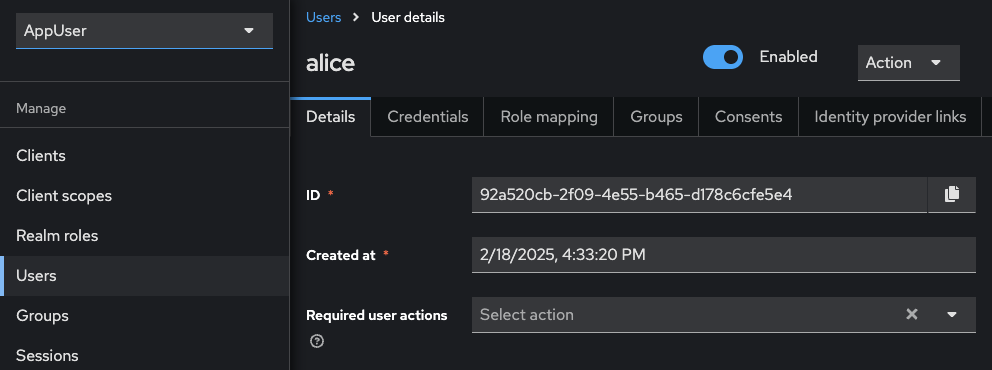
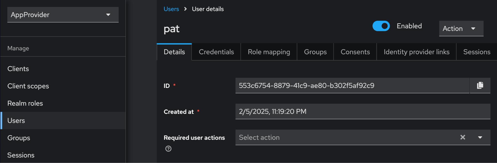

.. _keycloak-quickstart:

Keycloak in the CN QS
=====================

.. wip::

**Contents**

`Keycloak in the CN QS <#keycloak-in-the-cn-qs>`__

   `Realm structure <#realm-structure>`__

   `Keycloak configuration <#keycloak-configuration>`__

   `Customizing Keycloak for business needs <#customizing-keycloak-for-business-needs>`__

   `Accessing the admin console <#accessing-the-admin-console>`__

   `Customization scenarios <#customization-scenarios>`__

   `Add a new user <#add-a-new-user>`__

   `Modify client settings <#modify-client-settings>`__

   `Add a new client <#add-a-new-client>`__

   `Update environment variables <#update-environment-variables>`__

   `Troubleshooting <#troubleshooting>`__

Keycloak is an open-source Identity and Access Management (IAM) solution that provides authentication, authorization, and user management for modern applications and services.
It acts as a centralized authentication server that handles user logins, session management, and security token issuance.

The CN QS uses Keycloak to provide secure authentication across its distributed architecture.
Keycloak maintains separation between authentication concerns and business logic.

Realm structure
---------------

The CN QS defines two Keycloak realms.
The AppProvider realm manages authentication for services and users on the provider side of the application.
The AppUser realm handles authentication for the consumer side.
When components like validators or participant nodes receive requests, they validate the authentication tokens against the appropriate realm.

Keycloak configuration
----------------------

Predefined users each have their own environment file.
``app-provider``'s ``.env`` file is ``/env/app-provider-auth-on.env``,
and 
The default .env configuration includes predefined users in each realm:

-  **User "app-provider”** (AUTH_APP_PROVIDER_WALLET_ADMIN_USER_NAME=app-provider)

-  **UUID**: 553c6754-8879-41c9-ae80-b302f5af92c9
      (AUTH_APP_PROVIDER_WALLET_ADMIN_USER_ID)

AppUser realm:

-  **User "AppUser"** (AUTH_APP_USER_WALLET_ADMIN_USER_NAME=app-user)

-  **UUID**: 92a520cb-2f09-4e55-b465-d178c6cfe5e4
      (AUTH_APP_USER_WALLET_ADMIN_USER_ID)

-  **Password**: abc123 (AUTH_APP_USER_WALLET_ADMIN_USER_PASSWORD)

Customizing Keycloak for business needs
---------------------------------------

You can customize the Keycloak configuration to meet your specific
business requirements.

Accessing the admin console
~~~~~~~~~~~~~~~~~~~~~~~~~~~

The Keycloak admin console is available at:

http://keycloak.localhost:8082/admin/master/console/#/master

To log in use the default credentials:

-  **Username**: \``admin\``

-  **Password**: \``admin\``

Customization scenarios
-----------------------

Add a new user
~~~~~~~~~~~~~~

1. Log in to the Keycloak Admin console

..

   .. image:: images/42-keycloak-new-user.png
      :alt: Keycloak admin console
      :width: 30%

2. Select the appropriate realm (AppProvider or AppUser)

..

   .. image:: images/43-keycloak-realm.png
      :alt: Select Keycloak realm

3. Navigate to the “Users” -> “Add user”

..

   .. image:: images/44-keycloak-add-user.png
      :alt: Keycloak users view

Click **Add user**

   .. image:: images/45-keycloak-user-bob.png
      :alt: add user

4. Fill in the user details and click **Create**

..

   .. image:: images/46-keycloak-bob-details.png
      :alt: user details

5. Go to the **Credentials** tab to set a password

..

   .. image:: images/47-keycloak-credentials.png
      :alt: user password credentials

Set the password

   .. image:: images/48-keycloak-set-pw.png
      :alt: set password

6. Save the password

..

   .. image:: images/49-keycloak-save-pw.png
      :alt: save password

7. You can now sign in using the new user and their password.

   a. Return to the login page and click **AppUser**

..

   .. image:: images/50-keycloak-oauth-login.png
      :alt: login screen

Log in as Bob

   .. image:: images/51-keycloak-bob-signin.png
      :alt: sign in screen

8. Bob is now a user

..

   .. image:: images/52-user-bob.png
      :alt: logged in as Bob

Modify client settings
~~~~~~~~~~~~~~~~~~~~~~

1. Return to the realm selection view

2. Navigate to **Clients** -> select the client to modify

..

   .. image:: images/53-keycloak-client-settings.png
      :alt: modify client settings

3. Update settings per your needs

..

   .. image:: images/54-keycloak-update-settings.png
      :alt: update user settings

4. Save changes

Add a new client
~~~~~~~~~~~~~~~~

1. Select the appropriate realm

2. Navigate to “Clients” -> “Create”

..

   .. image:: images/55-keycloak-add-client.png
      :alt: client list

3. Configure the client's general settings. Click **Next** for additional
      configuration options

..

   .. image:: images/56-keycloak-config-client.png
      :alt: client details

4. Configure additional settings

..

   .. image:: images/57-config-adt-settings.png
      :alt: additional settings

Click **Next** for additional configuration options

   .. image:: images/58-cofig-settings-2.png
      :alt: additional settings 2

5. Save the client

Update environment variables
~~~~~~~~~~~~~~~~~~~~~~~~~~~~

After making changes to Keycloak configuration, you may need to update the corresponding environment variables in the ``.env`` file:

1. The Keycloak user must have the same ID as the ledger user's ID. This is not the party id.

2. For client changes, update the corresponding client ID and secret

3. For user changes, update the corresponding user ID and credentials

4. Restart the services to apply the changes:

``make stop && make start``

Troubleshooting
---------------

**Login failures**:

1. Verify Keycloak is running: ``make status``

..

   .. image:: images/59-verify-keycloak-running.png
      :alt: verify keycloak running

Find **keycloak** near **grafana** and **loki** in the list.

**Keycloak** should show as “healthy”

   .. image:: images/60-keycloak-healthy.png
      :alt: keycloak healthy

2. Check keycloak credentials in ``.env`` file

::

   AUTH_APP_USER_ISSUER_URL_BACKEND=http://nginx-keycloak:8082/realms/AppUser
   # for backend

   AUTH_APP_USER_ISSUER_URL=http://keycloak.localhost:8082/realms/AppUser #
   for backend, wallet-ui

   AUTH_APP_PROVIDER_ISSUER_URL=http://keycloak.localhost:8082/realms/AppProvider
   # for backend oidc client conf, wallet-ui

   AUTH_APP_PROVIDER_ISSUER_URL_BACKEND=http://nginx-keycloak:8082/realms/AppProvider
   # for backends

3. Check that the Keycloak user ID matches the ledger user ID

**App User**

Compare the **ID** value in Keycloak’s User Details with the ``AUTH_APP_USER_WALLET_ADMIN_USER_ID`` value in ``.env``.

.. note:: In this example, ``AUTH_APP_USER_WALLET_ADMIN_USER_ID=92a520cb-2f09-4e55-b465-d178c6cfe5e4``

**App Provider**

Compare the **ID** value in Keycloak’s User Details with the ``AUTH_APP_PROVIDER_WALLET_ADMIN_USER_ID`` value in ``.env``.

.. note:: In this example, ``AUTH_APP_PROVIDER_WALLET_ADMIN_USER_ID=553c6754-8879-41c9-ae80-b302f5af92c9``

Learn more about using Keycloak through their documentation portal:

`Keycloak official documentation <https://www.keycloak.org/documentation>`__

`Keycloak server administration guide <https://www.keycloak.org/docs/latest/server_admin/>`__

`Securing applications with Keycloak <https://www.keycloak.org/guides.html#securing-apps>`__
